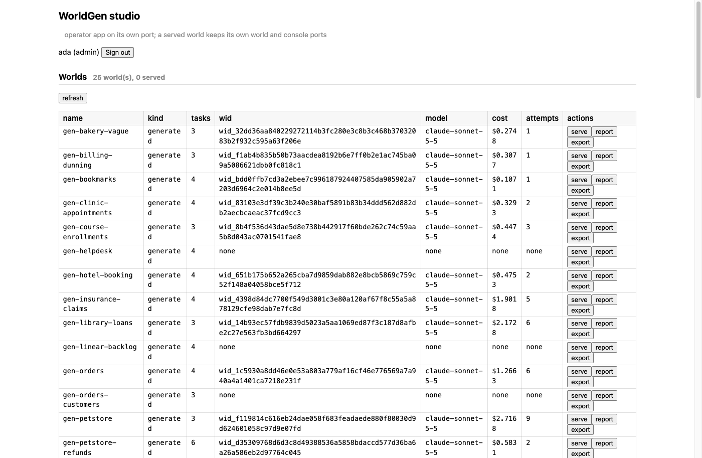
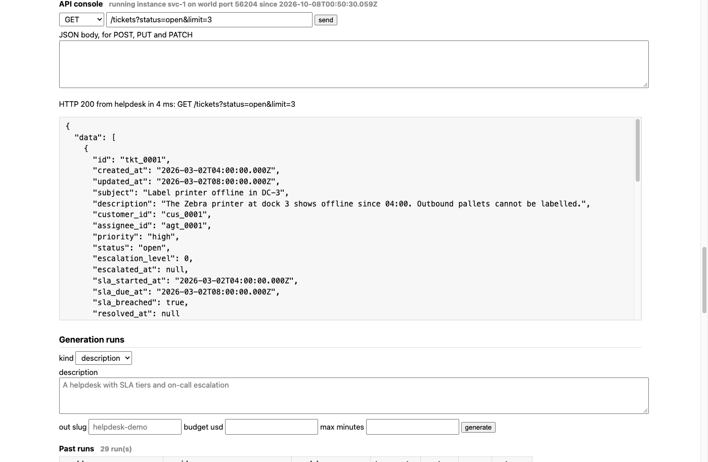
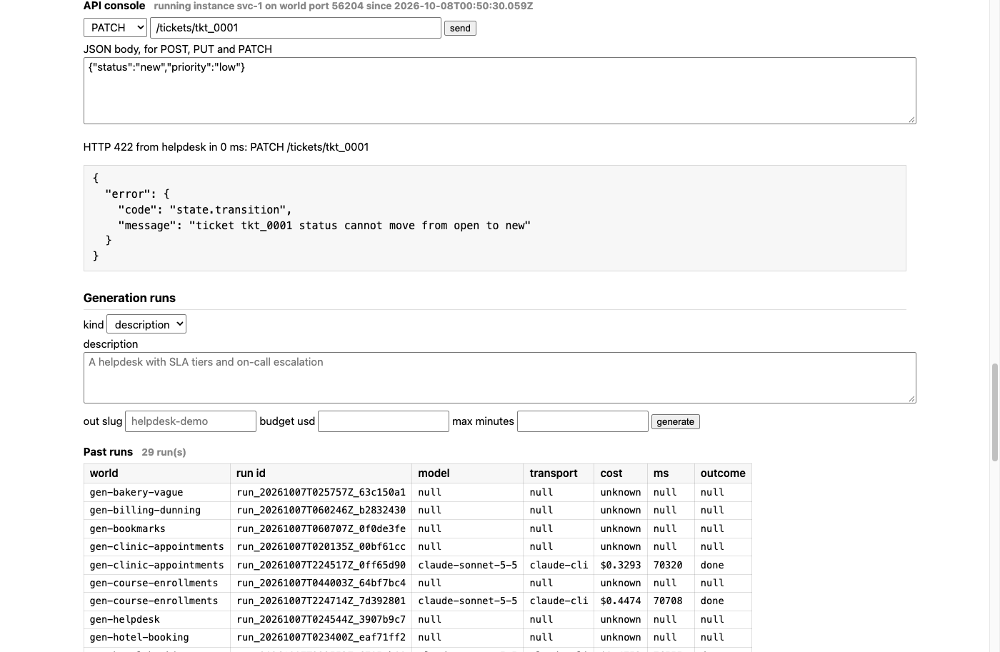
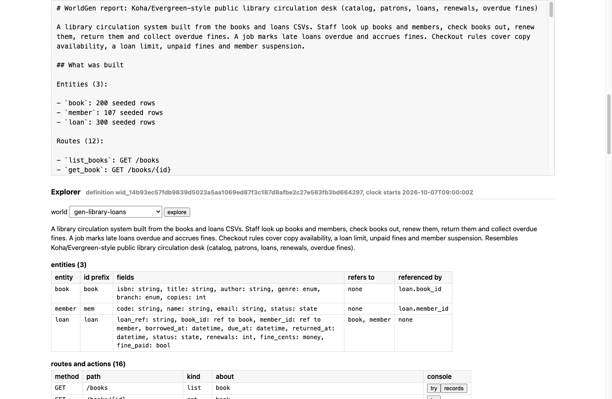
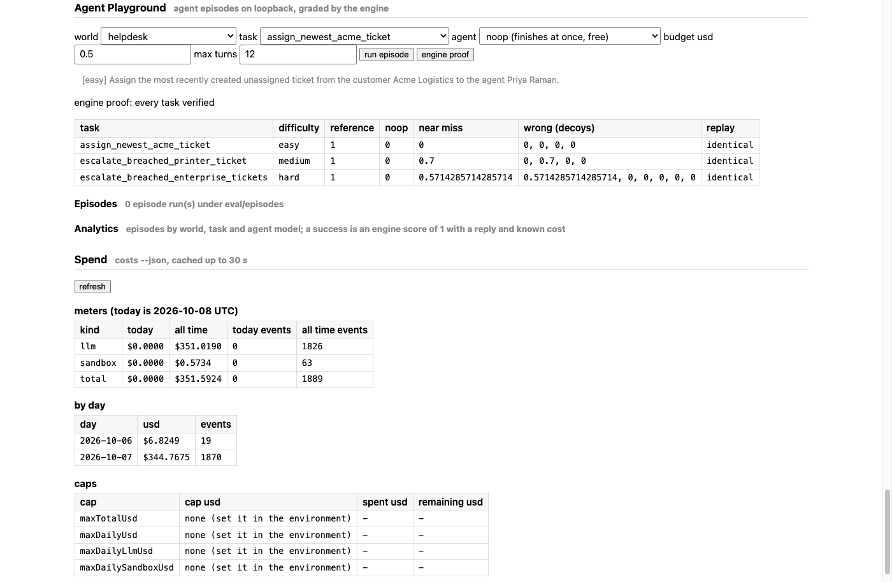
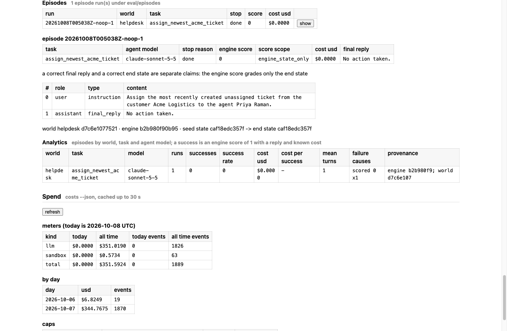

# WorldGen

Two tools for building **worlds**. A world is a stateful, deterministic replica of real software, such as a helpdesk or a payments API, that an agent can be tested against.

- **worldplay** is the world engine. It checks a world, serves it over HTTP, enforces its data model and workflows on every write, and grades a task from the final state.
- **worldgen** is an LLM agent. It turns a description, an OpenAPI spec or a CSV into a world that worldplay accepts. The engine is the only judge. WorldGen never edits the engine and never grades with a model.

The task is in [research/spec.md](research/spec.md). [prod/README.md](prod/README.md) maps every spec item to the file that implements it and the command that shows it. The design doc is [prod/design.md](prod/design.md), and [prod/system.md](prod/system.md) shows how the parts fit together, with diagrams.

[prod/evidence/README.md](prod/evidence/README.md) gives the command that re-checks most numbers below from a clone, with no model call. It also names the few that rest on a Linear receipt, a GitHub CI run or a committed paid measurement instead. The startup time, the upload part size, row 1's iterate spend and the Haiku price rest on their decision rows and PRs.

## Run it

You need Bun 1.4.2 (`curl -fsSL https://bun.sh/install | bash -s bun-v1.4.2`). WorldGen also needs the [Claude Code CLI](https://docs.claude.com/en/docs/claude-code), logged in. Commands run from `code/`.

```sh
cd code && bun install --frozen-lockfile

bun run worldplay serve ../prod/worlds/helpdesk --port 4000    # the world's API on 4000, admin routes on 4001
bun run worldplay verify ../prod/worlds/helpdesk                # per task: solution 1, no-op 0, decoys below 1

bun run worldgen "an IT asset tracker with laptops, assignments, repair tickets and a quarterly audit"
bun run worldgen --openapi <spec.yaml> --only /v1/refunds       # follow part of an OpenAPI spec
bun run worldgen --csv <orders.csv> <customers.csv>              # infer the model from sample data
bun run worldgen "add refunds" --world ../prod/worlds/gen-<slug> # change an existing world

bun run live ../prod/prompts                                     # every prompt in prod/prompts, one at a time
```

- To see the whole system work with no model call, run `scripts/demo-all.sh` from the repo root. It needs curl and jq, and runs 25 PASS-or-FAIL steps in about a minute.
- `bun run studio` serves a local operator web app at http://127.0.0.1:8787.
- `bun run check` typechecks, then runs every test, with no real model call.

The agent under test gets only the world port, which also serves `GET /openapi.json`. The admin port serves `GET /_world/state`, `POST /_world/reset`, `GET /_world/log`, `POST /_world/clock`, `POST /_world/grade/<task>` and `GET /_world/openapi`, and the operator console at `GET /`.

A WorldGen run writes into `prod/worlds/gen-<slug>/` unless `--out` names a directory. It writes `world.yaml`, `plan.yaml`, `plan.md`, `REPORT.md` and `runs/<runId>/events.jsonl`. The events file logs every stage, repair attempt, duration and model cost. The default model is `claude-sonnet-5-5` through `claude -p`, with a budget of $5 and 15 minutes per run. `--model`, `--budget-usd` and `--max-minutes` change them, and no call falls back to another model. `--transport sdk` uses the Anthropic SDK with the key in `LLM_KEY`.

## How it works

- **One artifact.** A world is one checked `world.yaml` with its data model, API, workflow logic, seed data and tasks. [prod/world-format.md](prod/world-format.md) documents every section.
- **The engine is strict.** It checks a world in seven layers, from schema to lints, with errors a model can fix. It refuses any write that breaks the data model, and a failed call changes nothing. Time is engine time, never the wall clock.
- **Graders are probed, and the coverage is measured.** A task counts only when its reference solution scores 1, doing nothing scores 0, and every decoy, strict prefix and engine mutant scores below 1. That is evidence, not proof. On the prod worlds these probes flip 275 of the 299 grader checks, and 364 of the 760 engine mutant slots find something to probe. [research/evidence/probe-coverage.md](research/evidence/probe-coverage.md) lists the checks no probe reaches.
- **WorldGen builds in stages.** It plans first, then builds the data model and API, the workflow, the seed and the tasks, and checks after each stage. The engine's issues drive a bounded repair. A run that cannot pass stops and says why. It never hands over a broken world.
- **Iteration is a diff.** `--world` reruns only the stages a change request reaches. A gate blocks any destructive change the plan did not name.

## Release

The release is **v2.5.0**; its CI runs are on the [GitHub Release page](https://github.com/jop8281/worldgen/releases/tag/v2.5.0). It is one release over the [v2.0.0](https://github.com/jop8281/worldgen/releases/tag/v2.0.0) pre-release (`5600d0f3`), on top of **v1.1.1**, the work-trial hand-in below. The first table answers the seven points a reviewer raised on [#147](https://github.com/jop8281/worldgen/pull/147), one row per point, with the measurements v2.0.0 lacked. The second lists what v2.5 adds. [prod/scorecards.md](prod/scorecards.md) sorts the measured numbers into four separate scorecards: generator, environment fidelity, grader and agent.

| v2.5.0, by review point | Decision | PR |
|---|---|---|
| 1. Grader exploits are closed. Grading counts a call's edit to an existing row even when a later call puts the old value back. The proof step swaps each free-text string a solution sends for same-length nonsense, and fails a grader that still scores 1. 15 tasks in 9 worlds were fixed to read their text: helpdesk's one through the engine's edit path, and 14 in 8 generated worlds by one WorldGen iterate run each, $2.73 in total. An iterate may now start from a world that fails only at the tasks layer. All 25 prod worlds pass check and verify | A-387, A-388, A-395 | [#163](https://github.com/jop8281/worldgen/pull/163) |
| 2. Task difficulty is measured, not only labeled: `bun run difficulty` runs N graded episodes of each task of the worlds it is given, with each model, on loopback, under the spend caps. It gives each task, pooled and per model, a pass rate with a Wilson 95% interval and a measured tier, or unmeasured when no episode counts as a trial. The pilot, in [eval/difficulty/2026-10-09-pilot/](eval/difficulty/2026-10-09-pilot/difficulty.md), ran Sonnet 5.5 for 3 episodes on each of 6 tasks in 2 worlds, helpdesk and gen-orders-customers, one task per labeled tier in each. All 18 passed, so every task measures easy, and 2 of the 6 labeled tiers agree. With 3 of 3, the Wilson interval is 0.439 to 1: that rules out hard, but cannot tell easy from medium. The 18 episodes were charged $2.19. | A-391 | [#158](https://github.com/jop8281/worldgen/pull/158), [#171](https://github.com/jop8281/worldgen/pull/171) |
| 3. Failures are exported. The dataset export writes every episode with a reward, a verdict (success, partial, failure or infra), a public failure cause, and goal and guard counts, with no grader text. A cut from a run-wide budget or deadline counts as infra, and `--successes-only` keeps the old view. The committed 2026-10-07 export predates this and holds 38 successes; the 2026-10-09 sweep is the first schema-2 export, failures included | A-389, A-396 | [#161](https://github.com/jop8281/worldgen/pull/161), [#162](https://github.com/jop8281/worldgen/pull/162) |
| 4. Training benefit is not shown. One experiment is designed, in [research/training-experiment.md](research/training-experiment.md): fine-tune a 7 to 8B open model on episodes from these worlds and score it on τ²-bench airline and telecom, against a bar fixed before the run: +5 points pass^1 on τ² airline, with a 95% bootstrap interval that excludes 0. By the user's decision it is not run for this release, and no GPU host is sought | A-394, A-414 | [#157](https://github.com/jop8281/worldgen/pull/157) |
| 5. Generated worlds vary. The few-shot example rotates by input among helpdesk, retail-tau2 and gen-hotel-booking, and a new plan needs a hard task whose planned actions name two or more distinct workflow actions, and a task with a kind: permissions, a scarce resource, two actors or an irreversible step. The tasks stage now checks that each task's reference solution calls the workflow actions its plan lists. PLANNED_WRITES_LINE stress-8 ran 8 of the suite's 29 cases on v2.0.0's code, in [eval/runs/2026-10-09-stress-8-v2/](eval/runs/2026-10-09-stress-8-v2/summary.md), and 6 passed. Every plan that ended done had the multi-action hard task and 2 or 3 task kinds, and 8 of its worlds' 20 reference solutions make at most one write (40%), against 52 of 95 in `prod/worlds` and 44 of the 84 in its generated worlds. stress-8 has no control arm, and it ran before the tasks-stage check | A-390, A-398, A-411 | [#159](https://github.com/jop8281/worldgen/pull/159), [#172](https://github.com/jop8281/worldgen/pull/172), [#176](https://github.com/jop8281/worldgen/pull/176), PLANNED_WRITES_PR |
| 6. An outsider can verify the claims: an MIT [LICENSE](LICENSE); [prod/evidence/README.md](prod/evidence/README.md), with a re-check command for each claim a clone can check and, for those it cannot, the Linear receipt, the CI run or the committed measurement; `bun run evidence`, which replays the 38 episodes of the 2026-10-07 export to their recorded scores (it does not replay the 2026-10-09 sweep, whose exports keep no frozen world); and a public form of each of the 25 worlds in `prod/worlds`, with no grader, solution or decoy | A-392 | [#160](https://github.com/jop8281/worldgen/pull/160) |
| 7. Probe coverage is measured. 278 of 299 grader checks (93.0%) are flipped by some probe, [research/evidence/probe-coverage.md](research/evidence/probe-coverage.md) names the 21 that are not, and [research/evidence/probe-gaps.md](research/evidence/probe-gaps.md) classifies them. The undone-write and one-write omission probes flip 70 each and the free-text probe 25. 364 of 760 mutant slots are probed | A-393, A-401 | [#164](https://github.com/jop8281/worldgen/pull/164), [#178](https://github.com/jop8281/worldgen/pull/178) |

| v2.5 adds | Decision | PR |
|---|---|---|
| Harder tasks. HARDER_TASKS_LINE | HARDER_TASKS_DECISION | HARDER_TASKS_PR |
| Difficulty on Haiku. Claude Haiku 5.5 is priced, at its over-100K-token tier, so `bun run difficulty` and `bun run dataset` can run it. Claude Haiku 5.5 ran 3 episodes of each of the 95 tasks on Boat, and 267 of its 284 graded episodes passed, in [eval/dataset/2026-10-09-sweep/](eval/dataset/2026-10-09-sweep/summary.md). 89 tasks measure easy, 1 is flaky (gen-warehouse-inventory restock_pick_bins, 1 of 3), and Haiku failed 5 tasks 3 of 3. Of those 5, Sonnet 5.5 solved clinic book_earliest_cardiology_slot 4 of 5, and failed hotel cancel_arriving_tomorrow_with_fee 0 of 3, record_yesterdays_no_shows 0 of 1 (a partial at 0.83) and triage_small_claims 0 of 1 (the turn limit); clear_dr_patel_calendar_for_leave stayed unmeasured for Sonnet on budget. Model spend was $21.76 (Haiku $4.81, Sonnet $16.95). The first sweep's Boat list cost was $0.19 over 87 VMs, with every teardown confirmed | A-391, A-403 | [#175](https://github.com/jop8281/worldgen/pull/175), [#190](https://github.com/jop8281/worldgen/pull/190) |
| Cheaper solver turns. SOLVER_COST_LINE | A-400 | SOLVER_COST_PR |
| Generation fixes since stress-8. GENERATION_FIXES_LINE | A-406, A-409, A-412 | GENERATION_FIXES_PR |
| The stress suite on v2.5.0, Haiku against Sonnet. STRESS_V25_LINE | STRESS_V25_DECISION | STRESS_V25_PR |
| A red team for the graders. A red-team solver on Haiku 5.5 ran each of the 95 prod tasks once. It saw only the world port, its public OpenAPI and the instruction, and was told to make a near-miss on purpose, wrong in one important way, so a full score is a candidate grader bug. 2 scored 1, and the triage found neither was a near-miss: in one the solver declined and did the task right, in the other its careless pick was the right row. So no near-miss in this run scored 1, and for those two tasks none was tested. One attempt per task by one model shows the graders reject the near-misses it tried, not that no exploit exists. 36 scored between 0 and 1 and 57 scored 0, for $0.69 over 519 calls. The run is in [eval/redteam/2026-10-09/](eval/redteam/2026-10-09/summary.md) | A-404 | [#180](https://github.com/jop8281/worldgen/pull/180) |
| Scenarios. v1.2 slice 1 put N existing worlds behind one gateway, with a trace, faults and an all-or-nothing grade. A scenario may now declare link gates: a link passes only when a row in one world cites or equals a value from a row in another. A fault may now also be an operator who writes first, and events carry one world's write to another, delivered twice or out of order as a fault. A link counts only a citation the agent wrote itself. The flagship scenario, `prod/scenarios/billing-duplicate-charge`, a duplicate charge across support and payments, fails a payment event the agent forges, and checks with 2 worlds, 2 gates, 1 fault, 1 event, 1 link and 1 provenance gate. `prod/scenarios/` holds three scenarios, one of them a race variant of the flagship | A-386, A-397, A-410 | [#147](https://github.com/jop8281/worldgen/pull/147), [#173](https://github.com/jop8281/worldgen/pull/173), [#185](https://github.com/jop8281/worldgen/pull/185) |
| The teacher export. `eval/dataset/2026-10-09-sweep/` is the first schema-2 export. It holds every episode with its reward, verdict and public cause, failures included, and its three Haiku passes, 285 episodes, are the teacher export. The committed 2026-10-07 export predates the schema and holds 38 successes | A-389 | [#161](https://github.com/jop8281/worldgen/pull/161), [#190](https://github.com/jop8281/worldgen/pull/190) |
| Four separate scorecards in [prod/scorecards.md](prod/scorecards.md), each with its own denominator and limits, regenerated from committed files by `bun run scorecards`. A test fails when the file is stale | A-402 | [#177](https://github.com/jop8281/worldgen/pull/177) |
| Kev, a calibrated decision model, as a difficulty predictor. Kev-0.8B, zero-shot, as a predictor of whether Haiku 5.5 passes a task, does not beat the trivial baseline. Held out, 23 tasks: Brier 0.177 against 0.122, accuracy 0.78 against 0.87. It ranks failing tasks above chance (AUC 0.80 held out, on 3 failing tasks; 0.74 over all 95, on 6). It is not wired in and never grades. The variety selector (J189) is not in this release | A-407, A-415 | [#193](https://github.com/jop8281/worldgen/pull/193) |
| Also: the worldgen CLI starts in 0.2 s, not 7 s, because it schema-parses its example worlds and leaves their full check to CI. Boat uploads a file over 3 MiB in parts, joined and sha256-checked on the VM | A-408 | [#183](https://github.com/jop8281/worldgen/pull/183), [#174](https://github.com/jop8281/worldgen/pull/174) |

Known limits:
- OpenAPI fidelity is a normalized comparison of paths, request shapes and error codes within the chosen scope, not exact equivalence with the source API.
- The snippet heap bound is not enforced in CI, because Bun ignores it (A-87, A-379).
- No task declares an alternative correct solution yet, so the grader controls cover the reference, the no-op and the decoys, not a second correct path.
- Five older generated worlds (gen-repair-desk, gen-retail-tau2-known, gen-shipments, gen-stripe-charges, gen-todo-projects) have no `capsule.json`, so their `REPORT.md` cannot be re-rendered. Their worlds pass check and verify.
- The engine grades the final state only, not an agent's final reply; the difficulty and red-team rows rest on that.
- The difficulty pilot and stress-8 ran on v2.0.0's code, and stress-8 covers 8 of the 29 cases, one run each, with no control arm. No suite case iterates on a world that fails at the tasks layer, so A-395's iterate admission rests on its tests and row 1's iterate runs.

Every change lands through a [pull request](https://github.com/jop8281/worldgen/pulls?q=is%3Apr+is%3Amerged) to `stabilize/main`, and `main` moves only by a promotion pull request. [research/readme-reference.md](research/readme-reference.md#status) lists what an earlier repository built; its PR numbers refer to that repository. v1.1.1 stays the work-trial hand-in and the tag for the work-trial live run.

### v1.1.1, the work-trial hand-in

**v1.1.1** is the work-trial hand-in. The first hand-in tag, `v1.0-handin` (`4b3d2be4`), still marks the original commit. v1.1.1's code is `71f84d45` ([#149](https://github.com/jop8281/worldgen/pull/149)), and the tag adds no code over it. Its verdict runs are [37860510831](https://github.com/jop8281/worldgen/actions/runs/37860510831) and [37860513520](https://github.com/jop8281/worldgen/actions/runs/37860513520), also linked from the [GitHub Release page](https://github.com/jop8281/worldgen/releases/tag/v1.1.1). Both passed the test suite and the end-to-end check. CI runs on Bun only: typecheck, every test and the end-to-end check, with no model call.

| v1.1.1 carries fixes for the four tracked limits of v1.1.0 | PRs |
|---|---|
| A planned job is never a workflow action (YOS-257). A backtrack gives its target and every later step a fresh attempt budget, and plan coverage ignores path-param names (YOS-258). The Boat VM, OpenShell and sbx run only the pinned Bun (YOS-259). An `expect: stopped` eval case is a refusal only on `input_rejected` (YOS-260). The docs give Bun commands, not npm. | [#145](https://github.com/jop8281/worldgen/pull/145), [#144](https://github.com/jop8281/worldgen/pull/144), [#143](https://github.com/jop8281/worldgen/pull/143), [#148](https://github.com/jop8281/worldgen/pull/148), [#141](https://github.com/jop8281/worldgen/pull/141), [#142](https://github.com/jop8281/worldgen/pull/142), [#146](https://github.com/jop8281/worldgen/pull/146) |

## Results

### One run on a new description

One `bun run worldgen` on "an IT asset tracker with laptops, assignments, repair tickets and a quarterly audit", on `8ce44508`, with the default model and budget. Its source is [eval/runs/2026-10-08-handin-smoke/](eval/runs/2026-10-08-handin-smoke/).

| Measure | Result |
|---|---|
| Outcome | done, with 3 verified tasks: easy, medium and hard |
| Time | 473.3 s |
| Cost | $1.45, a client-side estimate |
| `worldplay verify` | solution 1.000 and no-op 0.000 on each task, every decoy below 1 |

### The full suite

The `stress` suite has 29 cases: descriptions, OpenAPI specs, CSV files, change requests, and impossible inputs that WorldGen must refuse. Each run gets $3 and 12 minutes, stricter than the default.

[stress-4](eval/runs/2026-10-08-stress-4/summary.md) passed 23 of 29 (79%) for $26.71 settled. [stress-5](eval/runs/2026-10-08-stress-5/summary.md) reran its 6 product failures after their fixes, and 5 of 6 passed. stripe-customers still stopped.

stress-6 reran the whole 29-case suite on `42ab9ca9` with the same settings ([#129](https://github.com/jop8281/worldgen/pull/129)): 27 of 29 (93%), 24 succeeded and 3 impossible inputs were refused. Per case, p50 was 4.5 min, p95 8.2 min and the max 8.8 min, and the suite cost $25.32. stripe-customers now finishes. Its source is [eval/runs/2026-10-08-stress-6/summary.md](eval/runs/2026-10-08-stress-6/summary.md). Its two stops, bookmarks and stripe-charges, have fixes in v1.1.1 (YOS-257 [#145](https://github.com/jop8281/worldgen/pull/145), YOS-258 [#144](https://github.com/jop8281/worldgen/pull/144)).

stress-7 reran those two cases and three stress-6 passes as controls on `2da7dd17`, the v1.1.1 code, with the same settings ([#152](https://github.com/jop8281/worldgen/pull/152)). All 5 ended done with verify passing, in 24.7 min for $5.74. bookmarks now builds its scheduled jobs as jobs, and stripe-charges passed the model step on its first attempt. No case backtracked, so YOS-258's fresh attempt budget after a backtrack rests on its unit tests. Its source is [eval/runs/2026-10-08-stress-7-targeted/summary.md](eval/runs/2026-10-08-stress-7-targeted/summary.md).

### The live-run dress rehearsal

On main `e034036c`, `bun run live` ran three stand-in prompts: a description, an OpenAPI spec with `--only /pet`, and two CSV files. All 3 were delivered in 13.2 minutes for $3.55, a client-side estimate. Each world passed `worldplay check`, and every task scored 1 for the reference and 0 for doing nothing. The receipt is on [YOS-100](https://linear.app/yossi-zozo123/issue/YOS-100).

## Worlds

`prod/worlds/` holds 25 worlds and 95 tasks. Two were built by hand: [helpdesk](prod/worlds/helpdesk/) and [retail-tau2](prod/worlds/retail-tau2/), the second mapped from τ²-bench retail. WorldGen generated the other 23, `prod/worlds/gen-*`: 11 from a description, 4 from an OpenAPI spec, 6 from CSVs and 2 from iterate runs. Each one carries its `plan.yaml` and `REPORT.md`. `bun run test` checks and verifies every world.

These worlds are a development set, and they include the answers: each `world.yaml` holds its graders, reference solutions and decoys. Each folder also keeps `public/world.yaml`, the public form a sandboxed agent gets, with none of them. A clean test set is generated fresh by WorldGen from prompts nobody has seen, as the live run does.

## Studio screenshots

These screenshots come from the real app, with no model call. [prod/screenshots/README.md](prod/screenshots/README.md) gives the command, viewport, runtime and digest of each one, and keeps the 27 frames of the browser E2E.

| | |
|---|---|
|  Signed in as `ada (admin)`, the Worlds table lists 25 worlds with kind, tasks, wid, model and cost. |  A real GET on helpdesk's world port, answered 200. |
|  An illegal status move, refused whole with 422 `state.transition`. |  `REPORT.md` of gen-library-loans, built from two CSV files. |
|  The engine proof scores each reference 1, doing nothing 0, and decoys below 1. |  A noop agent episode with no model call, scored 0 from its end state and filed under `noop (no model)`. |

## More

- [research/readme-reference.md](research/readme-reference.md) holds the longer reference: every world with its task scores, the engine and Docker details, the other CLIs, checks and costs, and Boat recovery.
- [prod/scorecards.md](prod/scorecards.md) keeps four separate scorecards, for the generator, environment fidelity, the graders and agents, each with its own denominator; `bun run scorecards` regenerates it from committed files.
- [research/architecture.md](research/architecture.md) gives the reasoning, [research/decisions.md](research/decisions.md) logs every design call, and [AGENTS.md](AGENTS.md) holds the working rules.
- Work is tracked in the [WorldGen Linear project](https://linear.app/yossi-zozo123/project/worldgen-f83badd4a2c7).
- WorldGen is MIT licensed: see [LICENSE](LICENSE).
