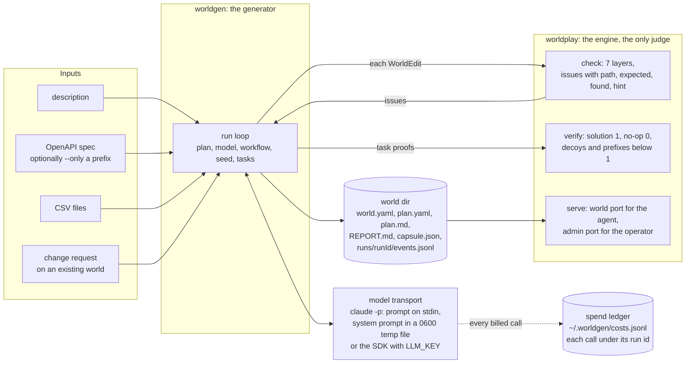
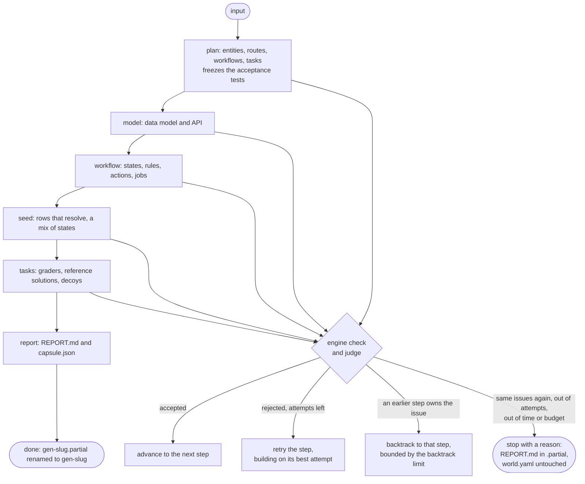
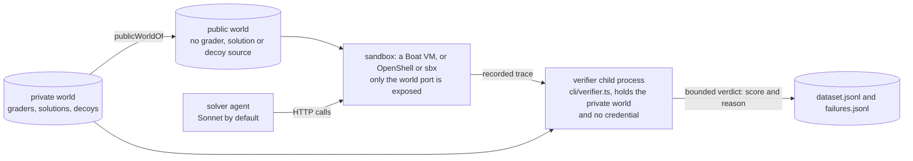
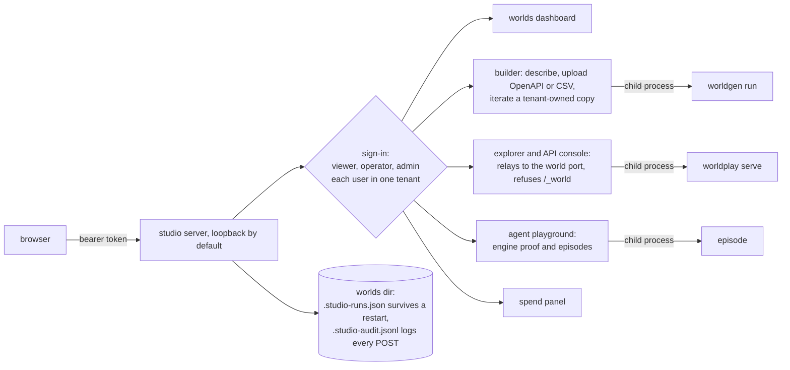
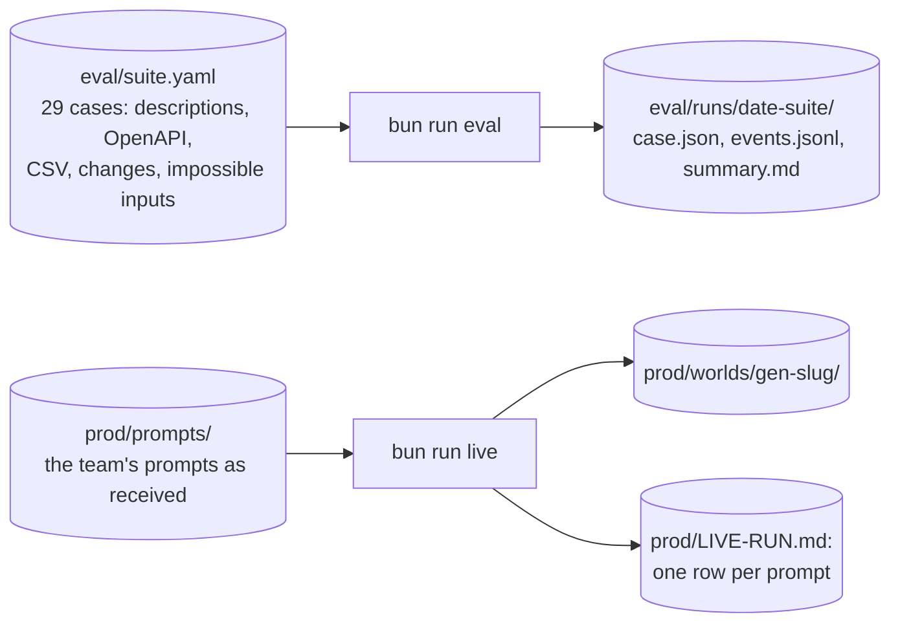

# The system, and how to run it

This page shows how WorldGen's parts fit together and gives the command for each one. Commands run from `code/` after `bun install --frozen-lockfile` on Bun 1.4.2, unless a line says otherwise. The spec is [research/spec.md](../research/spec.md). [README.md](README.md) maps each spec item to its evidence.

## The parts



- One checked `world.yaml` holds the data model, the API, the workflow logic, the seed and the tasks. [world-format.md](world-format.md) documents every section.
- WorldGen never edits the engine and never grades with a model. Only the engine's issues and proofs decide whether a stage passes.
- The model is a setting. `claude-sonnet-5-5` is the default, and `--model` accepts any Claude model with a known price. No call falls back to a different model.

## One WorldGen run



- Every stage, attempt, issue set, duration and cost is a `RunEvent` in `runs/<runId>/events.jsonl`.
- Each step gets a share of the run's time and money (A-48 default: $5 and 15 minutes). A call that will not fit is refused before it starts.
- `--world <dir>` runs a change request as an iterate. Only the stages the change reaches rerun, and a preservation gate blocks any destructive change the plan does not name.

## Grading without leaking the answers



- `bun run sandbox up` uploads the public form by default (A-377). `--private` uploads the private world, for debugging only.
- The verifier replays each trace from the seed and grades the state it reaches. It answers only the bounded verdict, so no private source reaches the solver or the export.

## The Studio



- Without a users file the studio is open, and every request is the local admin. It refuses to bind a non-loopback host unless sign-in is on.
- A tenant's runs, episodes, services and audit lines are isolated from other tenants. Its generations write into `<worlds-dir>/<tenant>/`.
- `scripts/studio-deploy.sh` runs the same server in Docker. Three volumes hold the worlds, the ledger and the episodes. The script supports backup, restore and rollback to an earlier image.

## Evaluation and the live run



- A summary counts five outcomes: success, expected refusal, product failure, infrastructure failure and not run. Only an `input_rejected` stop counts as an expected refusal (A-384).
- stress-6 ran the 29-case suite once on main `42ab9ca9` and passed 27 of 29 (93%): 24 successes and 3 expected refusals, with p50 4.5 min, p95 8.2 and max 8.8, for $25.32 settled. Its two failures, bookmarks and stripe-charges, both end done with verify passing in the stress-7 targeted rerun on the v1.1.1 code `2da7dd17`, which ran 5 of 5 for $5.74 ([summary](../eval/runs/2026-10-08-stress-7-targeted/summary.md)). stress-4 (23 of 29 on the hand-in candidate `4b3d2be4`) and stress-5 (its six failures rerun, five then passing) are the earlier steps. The source is [eval/runs/2026-10-08-stress-6/summary.md](../eval/runs/2026-10-08-stress-6/summary.md).

## How to run each part

Install, then try the engine:

```sh
cd code && bun install --frozen-lockfile
bun run worldplay check ../prod/worlds/helpdesk
bun run worldplay verify ../prod/worlds/helpdesk
bun run worldplay serve ../prod/worlds/helpdesk --port 4000
```

The world's API is on port 4000, with `GET /openapi.json`. The admin port 4001 serves `GET /_world/state`, `POST /_world/reset`, `GET /_world/log`, `POST /_world/clock` and `POST /_world/grade/<task>`.

Build worlds with WorldGen. It needs the Claude Code CLI, logged in:

```sh
bun run worldgen "an IT asset tracker with laptops, assignments, repair tickets and a quarterly audit"
bun run worldgen --openapi ../eval/inputs/petstore.openapi.yaml --only /store
bun run worldgen --csv ../eval/inputs/orders.csv ../eval/inputs/customers.csv
bun run worldgen "add refunds" --world ../prod/worlds/gen-refunds
bun run worldgen "a library with holds" --model claude-opus-5-5 --budget-usd 3 --max-minutes 12
```

Run the Studio locally. Then open http://127.0.0.1:8787:

```sh
bun run studio
```

Deploy the Studio in Docker. From the repo root, with `WORLDGEN_STUDIO_TOKEN` (and `LLM_KEY` for generation) exported:

```sh
scripts/studio-deploy.sh up
scripts/studio-deploy.sh health
scripts/studio-deploy.sh backup studio-backup.tgz
scripts/studio-deploy.sh rollback <earlier-image-tag>
scripts/studio-qualify.sh http://127.0.0.1:8787
```

Serve a world on a Boat VM, then build a graded dataset. Both need `BOAT_API_KEY`, `WORLDGEN_BOAT_ORG`, `BOAT_USD_PER_COMPUTE_HOUR` and a finite `WORLDGEN_MAX_DAILY_SANDBOX_USD`:

```sh
bun run sandbox up ../prod/worlds/helpdesk --backend boat --ttl 1800
bun run dataset --world ../prod/worlds/helpdesk --out ../eval/runs/dataset-helpdesk --run-id ds1 --engine-commit 6e28ba99 --max-turns 12 --budget-usd 2 --max-minutes 10
```

Evaluate, and run the team's prompts:

```sh
bun run eval --dry-run
bun run eval --only helpdesk-sla --out-dir ../eval/runs/2026-10-08-check
bun run live ../prod/prompts --dry-run
bun run live ../prod/prompts
```

Check the work and the spend:

```sh
bun run check
bun run costs --by run
../scripts/demo-all.sh
../scripts/qualify-main.sh --ref origin/main
```

- `bun run check` is the gate: typecheck, then every test, with no real model call.
- `demo-all.sh` walks the whole system in 25 PASS-or-FAIL steps with no model call.
- `qualify-main.sh` repeats the gate on a fresh clone of a ref.
- `bun run costs --by run` shows each run's spend from the ledger, and the caps when `WORLDGEN_MAX_*` is set.
