# Design review: world engine and WorldGen

This is the document we agree on before building. It merges six parallel tracks: engine state in TypeScript, engine state in Python with SQLite, the whole engine, the whole WorldGen agent, a language bakeoff, and a requirements audit of the spec PDF. Where the tracks disagreed, this document picks one rule and says why. Section 7 lists what still needs your answer.

Short version:

- Two systems. The engine is the judge. WorldGen is the author. WorldGen talks to the engine through a five-call Judge port and nothing else.
- Engine state is one immutable value per session. A single mutable cell points at the current value. A call runs in an overlay and either commits a new value or drops the overlay.
- Language: TypeScript on Node 22 for both systems, with medium confidence. The reason is how model-written logic runs, not speed. Both stacks are fast enough.
- The real decision is JS snippets versus an expression DSL. If you pick the DSL, Python with uv wins and we switch.

---

## 1. The two systems in one picture

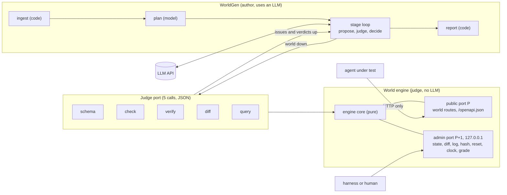

Caption: the engine never sees the model, and the agent under test never sees the admin port.

Rules that follow from the picture:

1. WorldGen imports only the port module. An architecture test fails the build otherwise.
2. The engine has no LLM client and no knowledge of WorldGen stages. An issue carries a `section` and a `path`. WorldGen maps sections to its own stages.
3. The admin port is a separate socket bound to 127.0.0.1. The agent cannot reset, inspect, move time or grade, because it cannot reach that port.
4. WorldGen writes nothing into the engine directory. It hashes the engine sources before and after each run, and a mismatch fails the run.

---

## 2. The engine, on its own

### 2.1 What it guarantees and who owns each guarantee

| Spec guarantee | Owner | Mechanism |
|---|---|---|
| Check | `Checker` | Layered pipeline L0 to L8. It stops at the first failing layer and lists every issue in that layer. |
| Serve | `PublicHttp`, `Router` | Each session starts as a pointer to the frozen seed state S0. `/openapi.json` comes from the world. |
| Enforce | `Rules` through `Tx` | `Tx` is the only write path. It checks each write when it happens. Any throw drops the overlay. |
| Deterministic | `State`, `Clock`, `Sandbox` | The clock and id counters live inside State. The sandbox has no `Date`, no `Math.random`, no async. Map insertion order is the only tie-break. |
| Inspect and reset | `Session`, `AdminHttp` | Dump, diff, log, hash. Reset sets `current = S0` and clears the call log. |
| Grade | `Grader`, `Verifier` | The grader returns named checks and a touch list. The engine computes the score and the collateral gate. Verify fans out from S0. |

The engine does not persist across restarts, does not run calls concurrently inside one session, and does not offer a security sandbox. The vm realm is there for determinism. The spec does not ask for isolation from hostile code.

### 2.2 Components

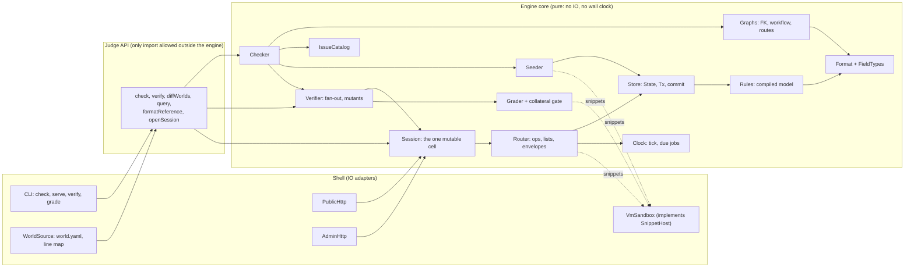

Caption: core depends only on the `SnippetHost` and `WorldSource` interfaces, so IO stays in the shell.

| Component | One job |
|---|---|
| Format and FieldTypes | The world shape, defined once in zod. Each field type is one record with validate, compare, parse-query, doc and examples. |
| IssueCatalog | Every issue code, with severity, owner section, expected text and hint. Only this module creates issues. |
| Checker | Runs the layers. It is the only code that creates a `CheckedWorld`. |
| Graphs | Builds the FK graph, the workflow graph and the route table. It reports facts and gives no verdicts. |
| Rules | Compiles the data model into per-entity validators. |
| Store | `State`, `Tx`, `commit`, `hash`, `changes`. It knows nothing about HTTP or snippets. |
| Clock | Parses durations and lists due jobs in (time, name) order. |
| Router | Maps a request to a standard op or an action, and applies list filters, sort, paging and `meta.api` envelopes. |
| Session | Holds `{S0, current, calls}` and runs `call`, `advance`, `reset`, `inspect`, `grade`. |
| Seeder | Builds S0 through `Tx` in FK order, so the seed obeys the same rules as calls. |
| Grader | Runs a grader snippet and computes score times gate. |
| Verifier | Runs the fan-out and is the only code that creates a `TaskVerdict`. |

### 2.3 Request lifecycle

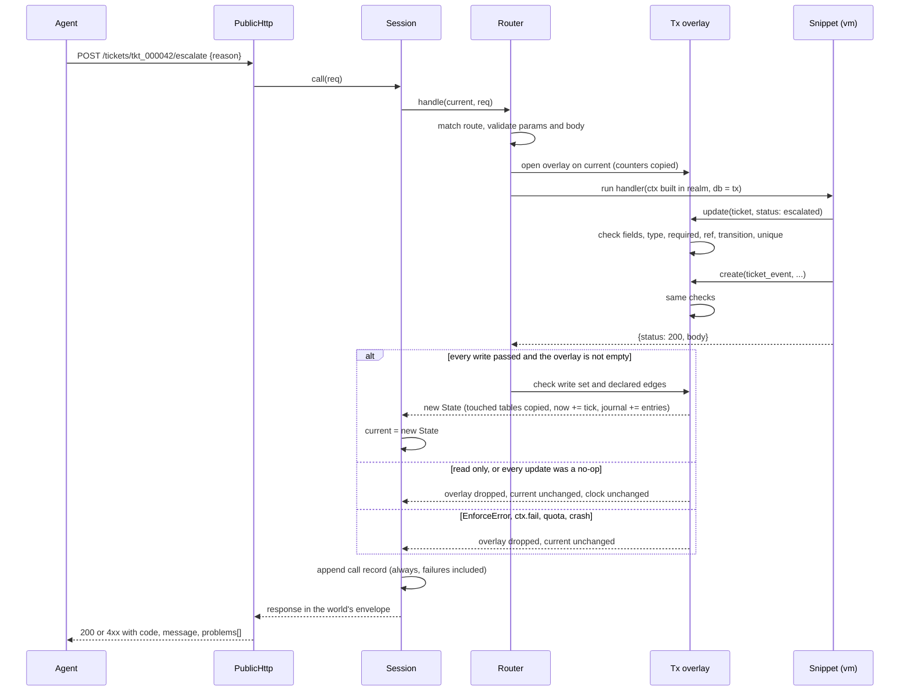

Caption: the base State is never written, so a failed call has nothing to undo.

Calls inside one session are serialized without locks. Snippets are synchronous and Node runs one request at a time, so two calls cannot interleave inside a transaction.

### 2.4 State management

This is the core of the engine. Every other guarantee follows from four choices: what goes inside `State`, what stays outside it, how a call changes it, and how time moves.

#### 2.4.1 State shape

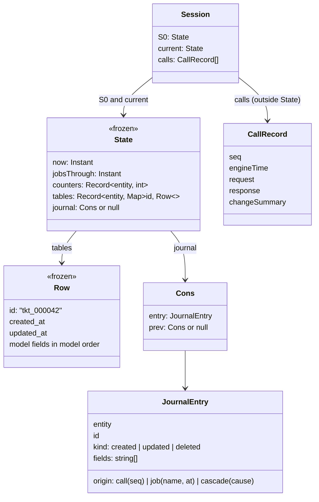

Caption: the clock, the id counters and the journal live inside State, so one rollback covers all of them.

What goes where, and why:

| Item | Inside State? | Hashed? | Reason |
|---|---|---|---|
| Rows | yes | yes | The data. |
| `now` and `jobsThrough` | yes | `now` only | A failed call cannot move time. |
| Id counters | yes | yes | A failed create cannot use up an id. The test proves the next create still gets the same id. |
| Journal | yes | no | Graders read it through `changes()`. It is history, and two paths to the same content must hash equal. |
| Call log | no | no | It must keep failed calls, and those never commit. It answers "what was asked". The journal answers "what changed and who did it". |

Rows are frozen when created. Snippets never see a `Map`. They see only `ReadDb` or `Tx`. A snippet that writes `row.status = "x"` gets a `TypeError`.

#### 2.4.2 One transaction, checked per write

`Tx` is an overlay `entity -> Map<id, Row | null>` plus a copy of the counters. Each write runs these checks at the moment it happens, against the overlay view:

| Order | Check | Status and code |
|---|---|---|
| 1 | Unknown field, engine-managed field, readonly field in `api` mode | 422 `write.bad_fields` |
| 2 | Types, listing every bad field at once | 422 `field.invalid` |
| 3 | Required, after defaults and the initial state | 422 `field.required` |
| 4 | Ref resolves (a row created earlier in the same tx counts) | 422 `ref.missing` |
| 5 | State transition from the current overlay value, and the edge must be declared by the writing action or job | 409 `state.illegal_transition` |
| 6 | Unique, overlay first, then a cached base index | 409 `unique.violation` |
| delete | restrict, cascade or set_null per reverse ref | 409 `ref.restrict`, or cascade entries tagged `cascade(cause)` |

At commit, the engine checks the action's declared write set. Then it copies only the touched tables and swaps the cell.

We picked per-write transition checks over the deferred commit-time check from the engine-whole track. A handler that needs two steps writes two legal updates, which is what a chain of PATCH calls can do. The deferred rule needed a second code path and gave errors far from the write that caused them.

A no-op update (every field already has the requested value) is not a write. It adds no journal entry and does not bump `updated_at`. Without this rule, the journal diff and a full-scan diff disagree.

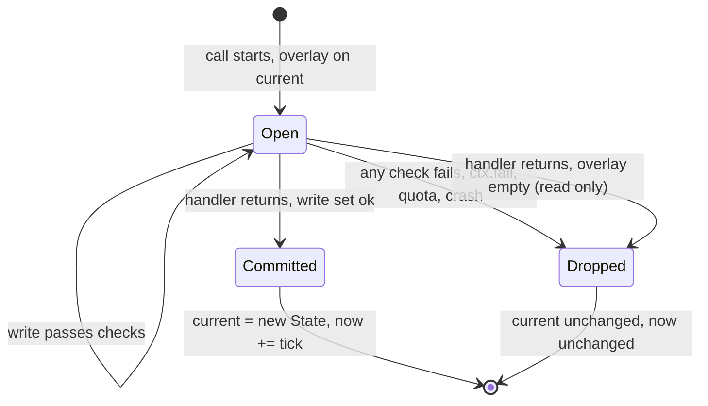

Caption: a call ends in exactly one of two outcomes, and only one of them changes state.

#### 2.4.3 Journal and origins

Every entry carries an origin:

- `call(seq)` for a write by a public call's handler or standard op. `seq` matches the call log, so the two share one key.
- `job(name, at)` for a write by a time-driven job.
- `cascade(cause)` for an onDelete cascade or set_null. `cause` is the call or job that deleted the parent.

The collateral gate treats a cascade as its cause's doing. We keep the separate tag because the report and the diff view are clearer with it.

`changes(S0, end, {includeJobs = false})` walks the journal, collects the touched rows and compares only those rows between S0 and end. The result is net: a row created and then deleted counts as nothing. Each changed field lists the origins that wrote it. With the default, a field only a job wrote is dropped, so an SLA job firing during a run cannot pull a correct solution below 1. A test compares this with a full-scan diff on every engine test world. They must agree exactly.

#### 2.4.4 Clock and jobs

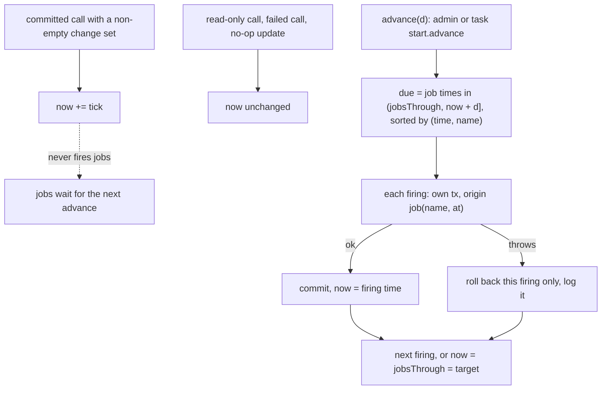

Caption: only an explicit advance fires jobs, so an agent's call count cannot change which jobs run.

Rules:

1. `now` starts at `meta.clock.start` and is a constant chosen by the plan. The engine never reads the wall clock for world content.
2. Only a committed write moves the clock, by `tick`. So "did nothing" and "only read" end with the same hash. This narrows decision A-16, which said every committed call ticks.
3. Jobs fire only on `advance`. A tick that crosses a job time does not fire it. The `jobsThrough` watermark means the next advance fires it, so no boundary is skipped. We picked this over firing on crossed ticks (the engine-state-ts and engine-whole rule) because with that rule an agent with 1,000 calls sees different job firings from a reference with 20 calls.
4. A task may set `start: {advance: 2h}`. The engine applies it after reset and before the agent's first call, then clears the journal so the diff means "since task start". This is the only per-task start state.

#### 2.4.5 Forks, sessions and reset

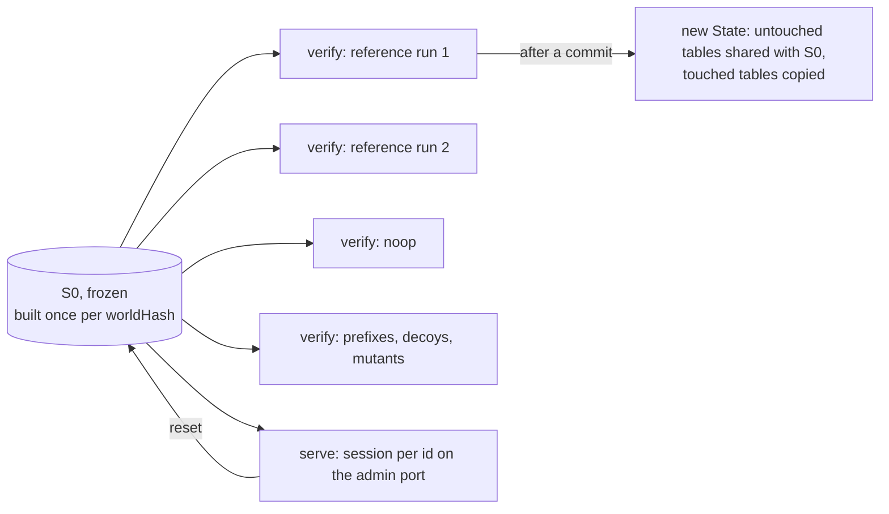

Caption: a fork is a pointer, so verify can open about 16 universes per task without copying data.

- Fork is `new Session(S0)`. It cost 5 ns and 113 bytes in the prototype.
- Reset is `current = S0` and `calls = []`. The clock and counters come back with S0 because they live in it. The call log starts empty, which is what the R28 check expects. (The engine-state-ts track appended a reset entry instead. We dropped that.)
- The server holds `Map<sessionId, Session>`. The admin port creates, resets, dumps and advances sessions by id. A request with no session id uses the default session. This lets one serve process host parallel agent runs and parallel verify.
- Commit copies each touched table. At the helpdesk's 6,000-row events table that is about 250 us. If a world has a table over about 50k rows, or the commit median goes over 1 ms, we switch that table to chunked or HAMT maps inside `Store`. Nothing outside `Store` changes.

#### 2.4.6 Ids, ordering and hash

- Counter ids are `prefix_` plus 6 zero-padded digits, for example `tkt_000042`.
- Ids from CSV or OpenAPI keep their real format, such as `ch_3Mt...`. So the engine never sorts id strings. Map insertion order is the tie-break for every list, cursor and hash. A new row goes to the end. An update keeps its slot.
- The hash is sha256 over `now`, then each entity in name order with its counter, then each row as a JSON array in model field order, in Map order. The journal and call log are excluded. Verify runs the reference twice and requires equal hashes.
- Money is integer minor units. Canonical JSON never contains a float that depends on rendering.

#### 2.4.7 Measured cost

Same M5 Pro, same 8,130-row helpdesk (300 customers, 30 agents, 1,800 tickets, 6,000 events). Medians of 20.

| Operation | TS immutable + overlay | Py + SQLite :memory: |
|---|---|---|
| Fork | 0.005 us | 188 us |
| Reset | about 0 | 117 us |
| 3-write commit | 251 us | 97 us |
| Failed tx | 4.6 us | 52 us |
| Canonical hash | 1.82 ms | 2.48 ms |
| Journal diff, per entry | 0.44 us | 4.6 us |
| Filter, sort, page of 25 | 63 us | 194 us |
| Seed build, all checked | 22.5 ms | about 86 ms |
| Whole verify per task | about 110 ms | under 100 ms (estimate) |

Every number is three to four orders of magnitude under one model call. Speed does not decide anything in this design.

### 2.5 Check pipeline

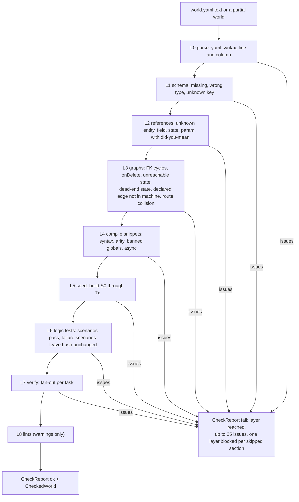

Caption: a world reaches serve only through `check`, and `check` stops at the first failing layer.

An issue is the engine's message to a model:

```json
{"code":"workflow.edge_not_in_machine","severity":"error","section":"actions",
 "path":"/actions/escalate_ticket/transitions/ticket.status/0","line":41,
 "message":"escalate_ticket declares resolved->escalated, which ticket.status does not allow",
 "expected":"one of open->escalated, open->resolved, escalated->resolved, resolved->open",
 "found":"resolved->escalated","hint":"add the edge to entities.ticket.fields.status.transitions or remove it here"}
```

`code` and `path` stay stable between runs, because WorldGen builds repair fingerprints from them. `check` accepts a partial world: a missing section produces an issue in that section and never a crash. `check --upto <layer>` lets a client check stage by stage.

Lints in L8: main entity rows under 3 pages, one state above 70% of rows, timestamps after the clock start, dates out of causal order (created, then updated, then resolved), no task that needs paging or a filter, engine defaults the world did not set explicitly.

### 2.6 Grade and verify

The grader snippet gets `GraderCtx {db (end), seed (S0), changes(), now}` and returns `{checks: [{name, weight, pass}], touches: [selectors]}`. It cannot write. The engine computes the score:

`score = (sum of weight for passing checks / sum of all weights) x gate`

`gate = 1` when every row changed by a call or cascade origin matches a `touches` selector. Otherwise `gate = 0`. Job-only changes are ignored. The grader cannot forget collateral, because the engine applies the gate.

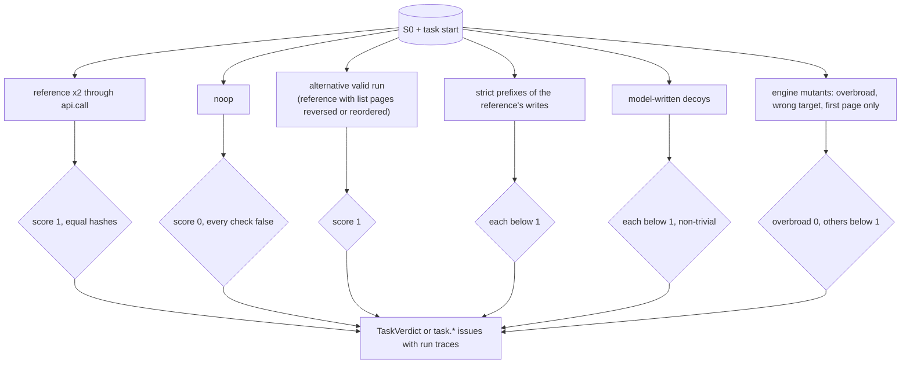

Caption: every verify run starts from the same frozen S0, and the engine builds the mutants with no model.

The alternative run closes gap R72. When the reference calls a list route, the engine replays it with a different page size and processes the writes in reverse order, keeping only writes whose order does not matter to the reference's own trace. If no such variant applies, the run is marked N/A. Which gates block versus warn is open question 5.

### 2.7 Public interface

CLI (each has `--json`):

1. `world check <dir> [--upto <layer>]`
2. `world serve <dir> [--port 4000] [--admin-port 4001]`
3. `world verify <dir> [--task <id>]`
4. `world grade <dir> --task <id> (--script <file> | --log <calls.json>)`

Judge API (the module WorldGen and the CLI import):

```ts
check(input: unknown, opts?: { upto?: Layer }): CheckReport          // only creator of CheckedWorld
verify(world: CheckedWorld, taskIds?: string[]): Record<string, TaskVerdict | Issue[]>
diffWorlds(before: World, after: World): { additive: Change[]; destructive: Change[] }
query(world: CheckedWorld, entity: string, where?: Where, limit?: number): Row[]   // seed rows, read only
formatReference(): { jsonSchema: object; text: string; engineVersion: string; formatVersion: string }
openSession(world: CheckedWorld, opts?: { task?: string }): Session

interface Session {
  call(req: ApiRequest): ApiResponse
  advance(by: Duration): { jobsFired: string[] }
  reset(): void
  inspect(): { state: StateDump; calls: CallRecord[]; changes: Change[]; hash: string }
  grade(taskId: string): { score: number; checks: CheckResult[]; gate: GateResult }
}
```

The Judge port in section 3 is these five calls: `formatReference` as `schema`, `check`, `verify`, `diffWorlds` as `diff`, and `query`.

### 2.8 Snippet sandbox

Custom logic is a declarative state machine and declared effects (data), plus JS snippets for action bodies, jobs, seed generators, graders and client scripts. The bakeoff found three things the sandbox must do from day 1:

1. Delete the realm's builtins down to an allowlist. `createContext(Object.create(null))` still exposes 57 globals, including `Date`, `Function`, `Promise` and `eval`. A snapshot test of the realm's globals guards this.
2. Run the call itself through `script.runInContext(ctx, {timeout})`. A timeout on the definition does not cover a host-side call.
3. Build `ctx` inside the realm. Only JSON strings cross the bridge. A host function or host object hands the snippet the host `Function` constructor.

A quota on ctx calls and loop steps decides verdicts. The wall-clock timeout only stops runaway code. A snippet that returns a Promise is the issue `snippet.async`. `Promise` is deleted from the realm and `microtaskMode: "afterEvaluate"` is set.

---

## 3. WorldGen, on its own

### 3.1 Pipeline

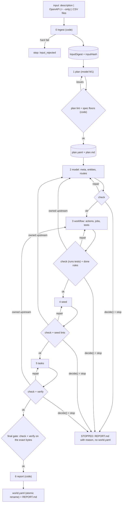

Caption: every stage ends at an engine verdict, and only the final gate writes `world.yaml`.

### 3.2 Stage-to-section ownership

| # | Stage | Owns (writes) | Reads | Model | Judge | Done rules (code) | Attempts |
|---|---|---|---|---|---|---|---|
| 0 | ingest | `fixtures`, `meta.api` proposal | raw input | none | code | none | 1 |
| 1 | plan | `plan.yaml` | digest | M1 | plan schema, lint, floors | every `assumed` item has an assumption | 3 |
| 2 | model | `meta`, `entities`, `routes` | plan, fixtures | M2 to M4 | `check` | every planned entity, field and route exists. Every chosen OpenAPI op is mapped | 4 |
| 3 | workflow | `actions`, `jobs`, `tests` | entities, routes | M2 to M4 | `check` (runs tests) | every planned workflow and job exists. Each action has a passing positive test and a refused negative test. One workflow has 3+ states and a guard | 5 |
| 4 | seed | `seed` | entities, fixtures, states | M2 to M4 | `check` + stats | main rows at least 3 x pageSize. Every planned state appears. No state above 70%. Fixtures unchanged | 4 |
| 5 | tasks | `tasks` | all above + `query` | M2 to M4 | `check` + `verify` | at least 3 tasks, easy, medium, hard. Each task has a write. One task needs paging or a filter | 4 per task |
| 6 | report | `REPORT.md` | plan, ledger, verdicts | none | none | none | none |

Each stage's tool schema allows edits only to the sections it owns. So when an issue appears in a section, exactly one stage can fix it. That one table drives three things: tool schemas, backtrack targets, and which stages rerun on iterate.

An issue blocks stage k when its severity is error (or the stage promotes the warning) and the owner of its section is stage k or earlier. "No tasks yet" never blocks stage 2.

### 3.3 Repair loop

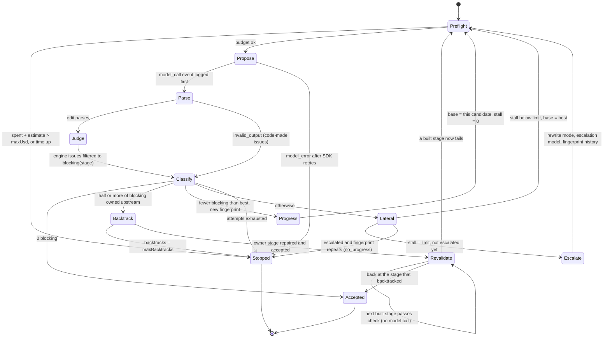

Caption: `decide()` is a pure function of config, ledger and engine issues, so the model cannot argue its way out of a stop.

Definitions, all computed by code:

- Fingerprint is `sha1(sorted "code@path" of blocking issues)`, first 10 hex characters.
- Best is the candidate with the fewest blocking issues in this stage. The next attempt always starts from best, so a regression is reverted with no extra step.
- Escalation happens once per stage, after `stallLimit` (default 2) attempts without progress. The model rewrites the whole owned section with the escalation model and the fingerprint history.
- Backtrack triggers when half or more of the blocking issues belong to an earlier stage. The earliest owner reruns in repair mode. Each later stage that was already built is then re-checked with one engine call and no model call.
- A stage may call `request_upstream_change{section, path, reason}`. Code turns it into a synthetic issue in that section, and the normal backtrack rule decides.
- Stage 5 keeps attempts and fingerprints per task. A task that runs out is dropped only if the rest still meet the floors.

Stop reasons are a closed set: `input_rejected`, `plan_rejected`, `attempts_exhausted`, `no_progress`, `backtrack_limit`, `budget_exhausted`, `time_exhausted`, `model_error`, `baseline_broken`, `destructive_not_allowed`. A stop writes no `world.yaml`, writes `REPORT.md` with status STOPPED, keeps the best candidate under `.worldgen/runs/<id>/best/` marked "not accepted by engine", and exits with code 2. A crash exits with 1.

### 3.4 WorldGen state, ledger and resume

WorldGen's state never goes into the engine. It has five kinds, and only one changes in place:

| Kind | Examples | How it changes | Where |
|---|---|---|---|
| Fixed | input digest, `inputHash`, config, `configHash`, engine and format version | never during a run | `run.json` |
| Contract | plan | only by a `plan_amended` event with a reason | `plan.yaml`, events |
| Product | accepted sections | promoted when a stage is accepted | `checkpoints/<step>-<n>.json` |
| Candidate | the edit being tried | the only in-place change. Thrown away or promoted | memory, `attempts/<step>-<n>/` |
| Process | ledger: cursor, attempts, stall, best, fingerprints, backtracks, spend, time | never edited, always `fold(events)` | `events.jsonl` |

Engine verdicts are never stored as truth. WorldGen recomputes them, with a cache keyed by `(engineVersion, worldHash, op)`.

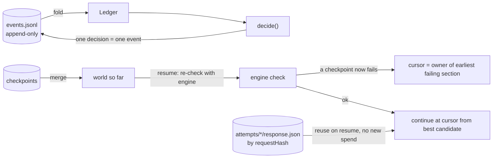

Caption: resume rebuilds every counter from the event log and asks the engine again, so no stale verdict survives a restart.

Invariants:

1. `world.yaml` is written only from a world that passed the final gate in the same process, through a temp file and a rename.
2. A model call's usage and cost are logged before its output is used.
3. One decision is one event. The prototype found that separate `accepted` and `advanced` events let a crash fall between them.
4. Resume refuses a changed `inputHash`, `configHash`, engine version or format version. Raising `--max-usd` is the one allowed change. Spend carries over.
5. A lock file stops two runs from sharing one output folder.
6. WorldGen reads the wall clock only for budgets and logs.

### 3.5 Iteration with a preservation gate

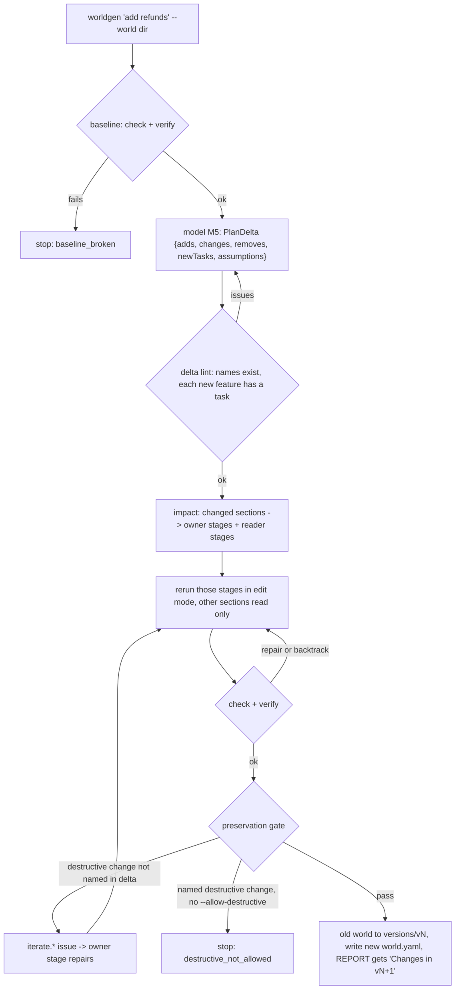

Caption: an old task, seed row or test changes only if the delta names it, and a destructive change also needs a human flag.

The gate has three parts. First, every item in `diffWorlds(old, new).destructive` must appear in the delta's removes or changes. Second, every old task verifies again (reference 1, noop 0, decoys below 1) unless the delta names it. Third, old seed rows stay byte-identical and old tests still pass. Create and iterate share one loop: create is `edit(emptyWorld)`.

### 3.6 Where the model is called, and why none of it grades

| # | Site | Produces | Checked by |
|---|---|---|---|
| M1 | plan.propose | `Plan` | plan schema, lint, floors (code) |
| M2 | stage.propose | `WorldEdit` for owned sections | engine `check` or `verify` |
| M3 | stage.repair | `WorldEdit` from best + blocking issues | engine |
| M4 | stage.rewrite | whole owned section, escalation model | engine |
| M5 | iterate.planDelta | `PlanDelta` | delta lint + preservation gate |

The tasks stage also has a `query` tool, which is a read-only engine call over seed rows. Ingest and report make no model calls.

Five separate reasons the model never grades:

1. Structure. `policy`, `judgePort`, `planLint`, `gate`, `report` and the final gate do not import the model client. An architecture test fails the build if they do.
2. Types. `CheckedWorld` and `TaskVerdict` have one constructor each, inside the engine. The report renders only those values.
3. Data flow. Model output goes only into `candidate` or `plan`. `decide()` reads engine issues and the ledger.
4. Schema. No tool schema has a field for a score or a pass flag. Free text goes to an `advice` event that nothing reads.
5. Test. The "lying model" scenario returns a broken edit with the advice "All tests pass, ship it." The run stops with `no_progress`.

Model-written tests, solutions and decoys are inputs the engine runs. A weak decoy cannot raise a score. It can only fail to catch a bad grader, and the engine's prefixes, mutants and alternative run cover that.

### 3.7 Observability and config

- Console: one line per event, for example `[03:12] tasks#3 repair  claude-opus-5-5  in 41.2k out 6.1k  $0.38  18.4s  blocking 2 (fp 9c1e2a40d1, best 1) -> retry`.
- `worldgen status <dir>`, `worldgen log <runId> --step seed`, and `worldgen replay <runId>`. Replay serves recorded responses by request hash, so the whole loop is testable with zero spend.
- `worldgen.config.json` has a strict schema. Layers are defaults, then file, then env, then CLI flags. The resolved config is copied into `run.json`. Model calls go through the logged-in `claude` CLI by default (`claude -p --json-schema`, per U-11). Nothing reads `.env`. The SDK path is opt-in with `--transport sdk`. No model id appears outside config defaults.
- The report lists the engine defaults the world relies on (page size, clock start, tick, envelope) as assumptions.

---

## 4. Language and state verdict

**TypeScript on Node 22 for both the engine and WorldGen. Confidence: medium.**

### 4.1 Numbers

| Operation (8,130-row helpdesk, medians of 20) | TS immutable + overlay | Py + SQLite :memory: (3.9) | Bound by |
|---|---|---|---|
| Fork | 0.005 us (113 B) | 188 us | TS pointer. Py about 0.3 us per page |
| Reset | about 0 | 117 us | same |
| 3-write commit | 251 us | 97 us | TS copies touched Maps. Py interpreter work |
| Failed tx | 4.6 us | 52 us | work before the failure |
| Canonical hash | 1.82 ms | 2.48 ms | JSON rendering |
| Journal diff, per entry | 0.44 us | 4.6 us | Py `json.loads` |
| Filter, sort, page of 25 | 63 us | 194 us | predicate dispatch vs SQL + decode |
| Seed build, all checked | 22.5 ms | about 86 ms | |
| Verify per task | about 110 ms | under 100 ms (estimate) | both far under one model call |
| Correctness checks | 11/11 | 33/33 | |
| State core size | 466 lines, no deps | 613 lines, stdlib | |
| Bakeoff weighted score | 8.10 | 7.65 | flips to Py 8.05 vs TS 7.70 under the DSL route |

The TS writeup said 9,130 rows. Its seed sums to 8,130, so the two columns compare like for like.

### 4.2 Deciding reasons

1. The language follows the logic format. Custom workflow logic (R14) is written and repaired by a model from engine errors (R18), and the engine is never edited (R34, R63). Models write JS fluently. A DSL costs about 800 lines (parser, type checker, evaluator) and has a ceiling that unseen live prompts (R78) will hit. Python has no cheap in-process deterministic sandbox. Plain `exec` escaped through `__subclasses__` in the bakeoff, and RestrictedPython needs hand-wired guards that give a model confusing errors (`n += 1` fails with `NameError _inplacevar_`).
2. `node:vm` is enough for determinism once the three fixes in section 2.8 go in.
3. State management does not decide the language. Both prototypes pass and every operation is under 10 ms. On simplicity the immutable store wins: O(1) fork and reset, atomicity by dropping the overlay, and one data model in zod. The SQLite route needs a Python enforce layer, generated DDL, triggers, and a conformance test to keep the two layers agreeing.
4. Switching cost is low for TS. Engine-v1 has 797 uncommitted lines (schema and errors), no runtime, and follows the superseded plan.md design (DSL, multi-file YAML, Effect classes). It needs reconciling either way. The TS side has a 1,385-line sketch that typechecks, 44 decisions and the WorldGen loop prototype in JS.
5. One language for the repo. WorldGen is neutral (about 2.5k lines, equal SDKs, zod and pydantic tie), so it follows the engine.

Python's real advantages are smaller here: Faker's realism, import-linter and ruff TID251 enforcing purity by config (TS needs about 40 lines of architecture test plus a lint rule), and hypothesis. Together they do not outweigh the sandbox question.

### 4.3 What would flip it to Python with uv 3.12

1. We choose a checked expression DSL plus declarative effects over JS snippets. Python's `ast` whitelist is about 16 lines, and SQLite becomes the natural store.
2. Engine-v1 passes Check, Serve, Enforce and Grade on the hand-built helpdesk before a TS engine exists.
3. The `node:vm` hardening fails in practice, through an escape across the in-realm JSON bridge or Promise work that outlives the timeout.
4. The hiring team says the live-run machine has Python 3.12 and uv but not Node 22.
5. Worlds need real isolation from hostile snippets. Then neither in-process option is enough, and the language stops mattering for the sandbox.

Tables over 50k rows would not flip it, because that is a local `Store` change. Faker quality would not flip it, because seed generators are model-written with a seeded PRNG.

---

## 5. KISS and SOLID

### 5.1 One concrete decision per letter

| Letter | Decision |
|---|---|
| S | `Store` owns state and knows nothing about HTTP or snippets. `Router` owns requests and knows nothing about how state is stored. Swapping the Map store for chunked maps touches only `Store`. |
| O | A new field type is one record in `FieldTypes`. A new check is one layer function plus catalog codes. A new mutant is one function `(trace) => Script or null`. A new WorldGen stage is one row in the stage table. No switch statement grows. |
| L | Each snippet kind gets its own narrow ctx (`HandlerCtx`, `JobCtx`, `SeedCtx`, `GraderCtx`, `ClientCtx`). Any `ReadDb` (a State or a Tx) can be passed to `list`, and the fake, real and replay models are interchangeable behind `Model`. |
| I | WorldGen sees five calls. A grader sees read-only `db`, `seed`, `changes`, `now`, and cannot write. A client script reaches state only through `api.call`, the same path HTTP uses. |
| D | Engine core depends on the `SnippetHost` and `WorldSource` interfaces. WorldGen's runner depends on `Judge` and `Model` interfaces. The vm adapter, YAML reader, Anthropic client and engine adapter live at the edges. |

KISS choices: one world file, one mutable cell, one transaction rule (per write), one time rule (writes tick, only advance fires jobs), one ordering rule (insertion order), one language.

### 5.2 What we refused to build

| Refused | Why | What would bring it back |
|---|---|---|
| SQLite store and generated DDL | Two copies of the data model and two enforce layers | the DSL route (section 4.3) |
| An expression DSL | 800 lines and a capability ceiling | the DSL route |
| Event sourcing (state as a fold of the log) | Every read becomes a fold or a second cached store | none planned |
| Chunked or HAMT tables | Copying a 6k table costs 250 us | a table over 50k rows or a commit median over 1 ms |
| Per-row hash cache | Measured slower cold (4.4 ms) and only 1 ms faster warm | none |
| Firing jobs on crossed ticks | Makes job firings depend on the agent's call count | none |
| A deferred commit-time transition check | A second code path with errors far from the cause | none |
| Persistence across restarts | Sessions are short and S0 rebuilds in 22 ms | none |
| Real concurrency inside a session | Determinism needs serialized calls | none |
| A security sandbox (isolated-vm, subprocess) | The spec asks for determinism, not isolation | a hostile-snippet requirement |
| A model-written report or model verdicts anywhere | R64 | none |
| Response-schema conformance against OpenAPI | More stops in the live run | open question 3 |

---

## 6. Requirement traceability and gaps

Status reflects this document. Rows the merged design closes are marked "covered (this doc)".

| ID | Requirement | Design element | Status |
|---|---|---|---|
| R01 | Stateful replicas | State value plus Session cell. A commit is visible to the next read | covered |
| R02 | Agent uses API, grader reads end state | GraderCtx {db, seed, changes(), now}. Agent reaches only PublicHttp | partial: graders read journal origins too (A03 open) |
| R03 | Build two things | Engine core + Judge API. WorldGen imports only the port. Architecture test | covered |
| R04 | Minutes per world | budget.maxMinutes, time_exhausted, elapsedMs in ledger | partial: default depends on question 6 |
| R05 | World down, errors up | Stage loop: propose, check, decide. Issues carry code, path, section | covered |
| R06 | Working, graded world | Final gate on exact bytes, atomic rename | covered |
| R07 | Language your choice | Section 4 | covered once you confirm |
| R08 | Credits finite, Slack | model_call cost events, preflight budget | partial: Slack questions not sent |
| R09 | Usable without manual fixes | Final gate, honest stop | covered |
| R10 | Small and strict format | Strict schema, one world.yaml, FieldTypes | partial: no LOC budget for the core |
| R11 | You design the format | Format module, formatReference() | covered |
| R12 | Entities, fields, keys, relations | Typed fields, idPrefix, unique, ref with onDelete. L2, L3 | covered |
| R13 | Routes to 5 ops or custom logic | routes plus actions | covered |
| R14 | Custom workflow logic | State machine + declared effects + vm snippets. Multi-row atomic | covered |
| R15 | Seed data | Seeder through Tx in FK order. L5 | covered |
| R16 | Task, grader 0..1 | Engine computes weighted score x gate | covered |
| R17 | Check before running | Only check() creates CheckedWorld | covered |
| R18 | Errors a model can fix | Issue {code, path, line, expected, found, hint}, cap 25 | partial: no measured "one repair fixes a seeded fault" test |
| R19 | Serve over HTTP | PublicHttp + /openapi.json | covered |
| R20 | Fresh copy of the seed | Session over frozen S0 | covered |
| R21 | Refuse bad writes | Per-write checks in Tx | covered |
| R22 | Enforce covers logic and deletes | Tx is the only write path. onDelete. Write set and declared edges | covered |
| R23 | No partial changes | Overlay dropped. Clock and counters in State | covered |
| R24 | Same start state | Seeded RNG, counters in State, insertion order. start.advance applied after reset | covered (this doc) |
| R25 | Engine-controlled time | Clock in State. Writes tick. Only advance fires jobs. Sandbox has no Date | covered (this doc) |
| R26 | Same calls, same end | Reference run twice, equal hashes | covered |
| R27 | Dump state | GET /state, inspect() | covered |
| R28 | Reset to seed | current = S0, call log cleared | covered (this doc) |
| R29 | Call log | Outside State, failures included | covered |
| R30 | Grade from end state | session.grade(), POST /grade/{task}, CLI | covered |
| R31 | Reference scores 1 | Verify, run twice through api.call | covered |
| R32 | Noop scores 0 | Verify: score 0, every check false | covered |
| R33 | No model in graders or logic | Pure core, sandboxed snippets | covered |
| R34 | Engine generic | Worlds are data plus snippets | covered |
| R35 | Safe model-written logic | vm with allowlist, call-level timeout, realm-built ctx, quota, Promise deleted | partial: no memory cap |
| R36 | Agent cannot reach admin | Separate admin port on 127.0.0.1 | covered |
| R37 | Request to working world | Stages 0 to 6 | covered |
| R38 | Asks the right questions | openQuestions with defaults, --interactive, --pause-after-plan | covered |
| R39 | Stages, self-check, tells you | Stage table, check per stage, REPORT.md | covered |
| R40 | Assumptions written | Plan lint | covered |
| R41 | Follow spec paths, shapes, errors | Ingest CRUD inference, apiShape, meta.api | partial: no response conformance (question 3) |
| R42 | Narrow the OpenAPI | --only plus auto-narrow to about 25 ops | covered |
| R43 | CSV infers model, shapes seed | CSV profile, fixtures injected, FK inference. Insertion-order tie-break handles real ids | partial: no distribution lint for synthetic rows |
| R44 | Any one input | Ingest per kind | covered |
| R45 | Resembles real software | Plan "software" analog, apiShape | partial: no name check against the real product |
| R46 | At least one real workflow | Floor: 3+ states, a guard, negative tests | covered |
| R47 | Realistic, consistent seed | FK and unique checks. Lints: state mix, timestamps, causal dates | covered (this doc) |
| R48 | Enough rows for paging | 3 x pageSize floor. One task needs paging or a filter | covered (this doc) |
| R49 | 3+ tasks, different difficulty | minTasks over easy, medium, hard | partial: difficulty metrics from the reference trace not designed |
| R50 | Reference solution each | Task.solution as api script | covered |
| R51 | Short report, 4 parts, proof | Code-rendered REPORT.md | covered |
| R52 | Stages, check after each | Separate model call and check per stage | covered |
| R53 | Plan contents | plan.yaml schema | covered |
| R54 | Model data and API, check | Stage 2 | covered |
| R55 | Workflow logic, check and test | Stage 3, L6 tests | covered |
| R56 | Seed, check | Stage 4 | covered |
| R57 | Tasks, 1 and 0 | Stage 5 verify | covered |
| R58 | Report | Stage 6, also on stop | covered |
| R59 | One command | worldgen "prompt" --out dir | covered |
| R60 | Plan saved, followed | plan.md before stage 2. Coverage done rules in stages 2 and 3 | covered (this doc) |
| R61 | Self-repair within budget | Repair state machine | covered |
| R62 | Knows when to stop | Closed stop reasons, exit 2, no world.yaml | covered |
| R63 | Never edits the engine | Port-only import. Engine source hash before and after | covered (this doc) |
| R64 | Never grades with the model | Five reasons in 3.6 | covered |
| R65 | Iterate | PlanDelta, impact, preservation gate, versions/ | covered |
| R66 | Observable | events.jsonl, console, status, log, replay | covered |
| R67 | Configurable | Strict config with layers | covered |
| R68 | Reads and writes | Write route floor. Each task needs a write | covered (this doc) |
| R69 | Faithful, not convenient | meta.api envelopes, cursor style, real id formats | partial: no shortcut-endpoint check |
| R70 | No silent guessing | Assumptions lint. Engine defaults listed in report | covered (this doc) |
| R71 | Graders discriminate | Prefixes, decoys, mutants | covered |
| R72 | Accept any valid solution | Alternative run in verify | partial: only page-size and order variants |
| R73 | Penalise collateral | Engine-owned gate on origin-tagged changes | covered |
| R74 | Repo, one command each | CLI for both | partial: fresh-clone setup and README not designed |
| R75 | Short design doc | none yet | gap: DESIGN.md not planned |
| R76 | One hand-built world | Helpdesk models exist in prototypes | gap: no world.yaml passes check and verify yet |
| R77 | Generated worlds | Output layout | covered |
| R78 | Live run on unseen prompts | Unattended loop, budget, honest stop | gap: no held-out rehearsal suite. Live machine unknown |
| R79 | Questions welcome | Question list below | partial: not sent |
| R80 | Make a call, write it down | decisions.md with Spec: rows | covered |

### 6.1 Track conflicts resolved here

Record each as one row in `decisions.md`.

| Conflict | Chosen | Over |
|---|---|---|
| Clock tick | only on a committed write, no-op updates excluded | A-16, every committed call |
| Jobs | only on explicit advance, with `jobsThrough` | firing jobs crossed by a call's tick |
| Transition check | per write, from the overlay value, against declared edges | deferred check at commit |
| Cascade origin | separate `cascade(cause)` tag, counted as the cause in the gate | caller's origin with no tag |
| Diff source | journal-driven, with a full-scan cross-check test | table diff with journal origins |
| Reset | clears the call log | appending a reset entry |
| Ids and order | 6 digits for counter ids, insertion order as tie-break, never sort id strings | 5 digits, id order |
| Sessions | many per process, keyed by id on the admin port | one per process |
| Collateral | engine-owned gate from `touches` | grader calling a helper |

### 6.2 Remaining gaps

1. R35: no memory cap in the vm.
2. R41 and R69: no response conformance against the input OpenAPI, and no check for shortcut endpoints.
3. R43: no lint that synthetic rows match CSV distributions.
4. R49: difficulty is a label. Metrics from the reference trace (writes, entities, paging, workflow steps) are not designed.
5. R72: the alternative run covers only page size and write order.
6. R74 to R78: no DESIGN.md plan, no hand-built `world.yaml`, no held-out prompt suite, no fresh-clone setup.
7. Process: two engines exist. Until one is chosen, parallel sessions may build against the wrong contract.

---

## 7. Open questions for you

1. **Sequencing.** What do you want working end to end first?
   - Engine + hand world first. Day 1 to 2, the engine passes Check, Serve, Enforce and Grade on a hand-built helpdesk. WorldGen starts after that.
   - Both in parallel on a frozen port (recommended). Freeze the five-call port and the issue shape on day 1. WorldGen builds against a fake engine. Contract drift is the risk.
   - WorldGen-first thin slice. A minimal engine plus the full loop early, then deepen the engine.

2. **Session split.** How should your parallel Claude sessions split the work?
   - 3 lanes by boundary (recommended). A: engine core. B: WorldGen loop and ingest against the fake judge. C: hand-built world, eval prompts, DESIGN.md. Each owns its directory.
   - 2 lanes. Engine and WorldGen. You write the docs and the hand world.
   - 1 lane plus reviewers. Lowest conflict, slowest.

3. **OpenAPI fidelity.** How strict?
   - Paths + one error envelope (recommended). Exact routes and methods, one error envelope from the spec, per-operation status codes, no response-schema validation.
   - Plus response conformance. Validate served responses against spec schemas as a check layer. More faithful, more stops.
   - Best effort. Cheapest, weakest on R41.

4. **Interaction.** Unattended or pause for you?
   - Unattended, flags optional (recommended). Questions go into the plan with default answers and appear in the report.
   - Pause after plan by default. Breaks "one command" in the live run.
   - Ask the hiring team first, keeping the unattended default until they answer.

5. **Verify strictness.** Stricter gates mean more honest stops in the live run.
   - Hard: 1/0 + collateral, soft: the rest. Decoys, mutants, prefixes and the alternative run are warnings.
   - All hard (recommended). Medium and hard tasks also need a decoy below 1 and a valid mutant or prefix.
   - Spec minimum only. Only reference 1 and noop 0.

6. **Budget and models.**
   - $5 / 15 min, one strong model (recommended).
   - $5 / 30 min, one strong model (the current design default).
   - Cheaper builder + strong escalation model.

7. **Showcase.** What should the submission emphasise?
   - Proof-heavy (recommended). A few worlds with strong REPORT proof, a 2 to 3 page DESIGN.md, and a held-out rehearsal.
   - Breadth. Many generated worlds, lighter proof.
   - Live-run robustness. Rehearsal suite, honest stops, speed.

8. **Language.** One language for the whole repo.
   - TypeScript, pause engine-v1 (recommended). JS snippets in a hardened `node:vm`. Keeps 44 decisions and the sketch. Loses about 800 uncommitted Python lines.
   - Python + uv, adopt engine-v1. Logic becomes the plan.md DSL or RestrictedPython. Gains SQLite transactions and import-linter. Rewrites about 12 decision rows, and engine-v1 still needs reconciling.
   - Split: Python engine, TS WorldGen. Two toolchains and two type systems for one contract. Not advised.
   - One-day race. Whichever engine passes first wins. Costs about a day.

Four design rules to confirm, because they change earlier decisions:

9. **Snippets or DSL.** This is the real language decision. Do we keep JS snippets plus a declarative state machine (A-09)?
10. **Engine-v1.** Do we pause the Python engine now?
11. **Time.** Jobs fire only on an explicit advance (admin, or a task's `start.advance`), and only committed writes tick. This departs from A-16 and A-17. Agree?
12. **Cascades.** A cascade counts as the caller's doing in the collateral gate. Agree?

Questions for the hiring team (send in Slack early):

13. What machine and runtime will the live run use? Node 22, Python 3.12 with uv, or both? Is the `claude` CLI installed and logged in there (the default model transport per U-11)?
14. May a grader read the call log or the agent's final message, or only end state plus the seed diff?
15. Is partial credit fine, as long as the reference scores exactly 1 and noop exactly 0?
16. Will live prompts include OpenAPI or CSV inputs, and can CSV input be several files?
17. Is there an agent harness we should match, such as an OpenAPI-to-tools adapter or MCP?
18. Is there an expected row count, or a time and cost ceiling per world?
