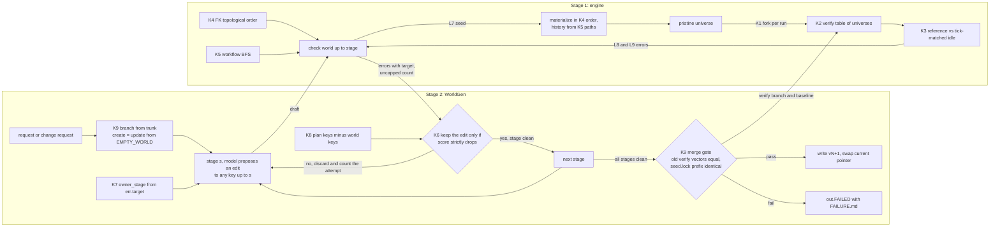
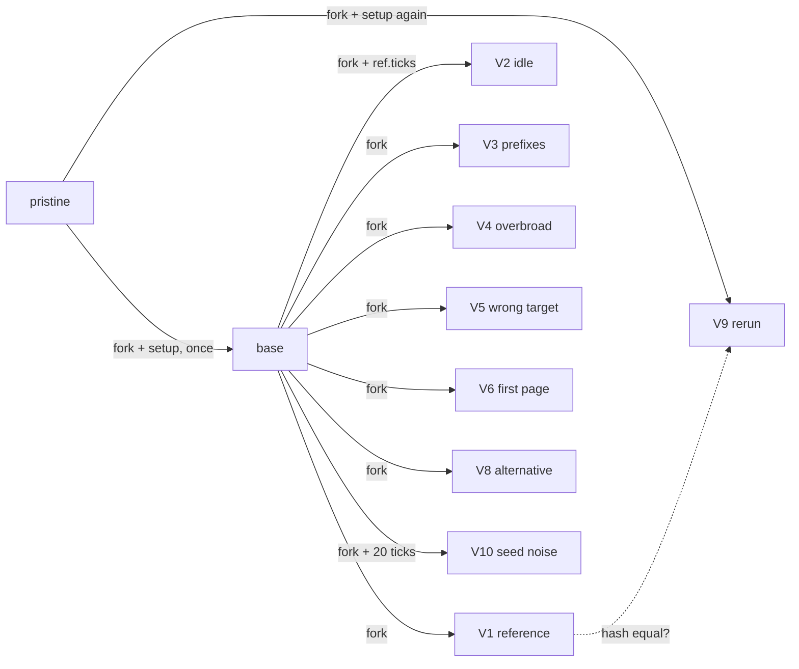
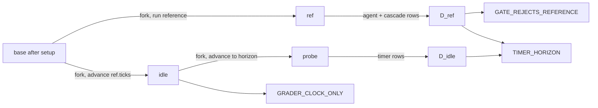
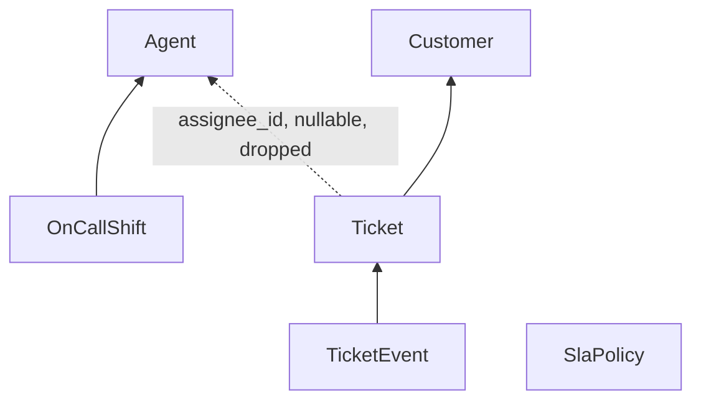
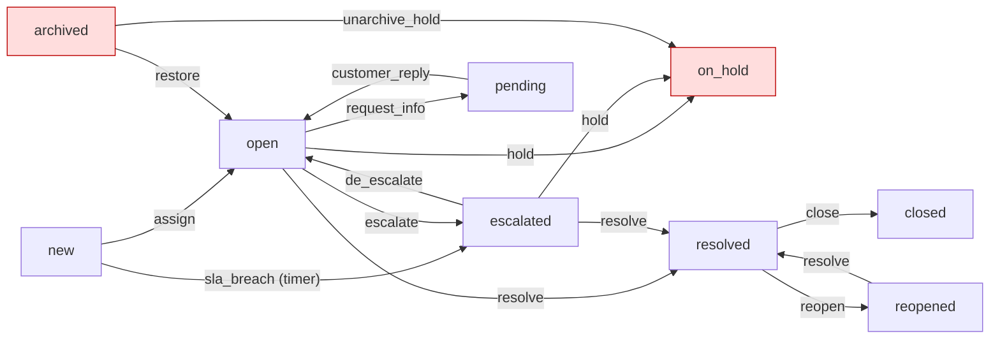
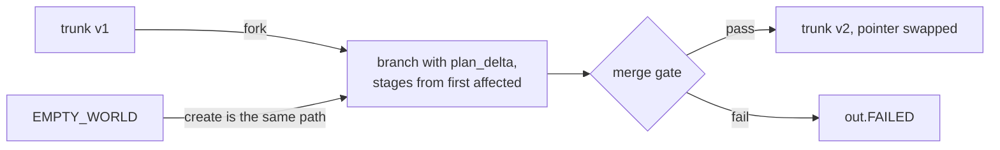

# Graphs and parallel universes in the two-stage design

Decision record, 2026-10-06. It draws on [plan.md](plan.md) sections 1, 2 and 4 to 7, on [related-work.md](related-work.md), on a stdlib prototype (section 7 of this doc) and on two independent reviews of 27 ideas. A mechanism is kept only if it deletes code, branches or failure modes, or directly serves a spec bullet. KISS wins ties.

## 1. The answer

Graph theory and parallel universes help in one narrow way here. They replace hand-written sequencing code with a structure the system already has. In the engine (stage 1), the world contains two real graphs, the foreign keys between entities and the states and actions of each workflow. A topological sort of the first and a breadth-first search of the second give the insert order, the seed history paths and the workflow Check errors, and the search caught a real bug in our own helpdesk example. The engine's universes are SQLite databases forked with the backup API in 0.114 ms. Reset, a new session and every verify run become one call, `pristine.fork()`, and a reference universe compared with a tick-matched idle universe gives the exact change a correct solution makes. In WorldGen (stage 2), the universe is the world draft itself, held as an immutable value. The repair loop keeps a candidate edit only when the engine's score strictly drops, and every create or update runs on a branch that reaches `<out>` only through the regression gate. That deletes the revert, oscillation and threshold rules in plan section 6, and honest failure follows from the structure instead of from cleanup code. Graph theory does not pay where the graph is a fixed chain of seven stages, or where it would only narrow prompts, so the stage scheduler, the reference graph for impact analysis and every search over agent actions are deferred or rejected.

## 2. Where each kept mechanism sits

The nine kept mechanisms are K1 to K9. Engine-side mechanisms change what `check` and `verify` compute. WorldGen-side mechanisms change how the loop reacts to the engine's answer. No mechanism adds an arrow between the two stages. The interface stays `check`, `verify` and `query_seed`.



| Mechanism | Side | Arrow it changes |
|---|---|---|
| K1 universe fork | engine | pristine to every run, and reset |
| K2 verify as a table of universes | engine | the fan-out inside `verify` |
| K3 counterfactual idle universe | engine | which L8 and L9 errors come back |
| K4 FK topological order | engine | check to materialize, and DDL order |
| K5 workflow BFS | engine | L4 errors, and history paths into materialize |
| K6 accept only if the score drops | WorldGen | errors to the next proposal |
| K7 owner_stage from the error target | WorldGen | errors to the stage that gets the edit |
| K8 plan coverage by set difference | WorldGen | adds coverage errors to the score |
| K9 branch and merge through the gate | WorldGen | the last stage to `<out>` |

## 3. Kept mechanisms

### K1. One universe value with fork as the only state operation

| | |
|---|---|
| Universe | One SQLite `:memory:` connection plus its lock. The clock and the ID counters live in a `_meta` table and the origin-tagged changes live in a `_journal` table, so the database holds all world state. |
| Algorithm | `fork` copies every page with `Connection.backup` into a fresh `:memory:` connection. Reset is `session.u = pristine.fork()`. Nothing is undone in place. |
| Data shape | `Universe(db, lock, failed_calls)`. `failed_calls` is a Python list because a rollback would erase it from the database. `hash()` covers world tables and `_meta` and leaves out `_journal` and `failed_calls`. |
| Replaces | The four-step reset (restore the database, reset the clock, reset the counters, clear the journal) and its forget-a-step failure mode. It also removes state leaks between verify runs. |
| Spec bullet | Inspect and reset. Deterministic (the clock and counters come back on reset). Check, Serve and Enforce atomically (one connection per universe, one transaction per request). |
| Measured cost | 0.114 ms per fork for 8,130 rows in 218 pages, against 5.70 ms to rebuild from rows. Both costs stay flat per page and per row up to 98,130 rows. |

```python
class Universe:
    def __init__(self, db):
        self.db, self.lock, self.failed_calls = db, threading.Lock(), []
    def fork(self):
        with self.lock:
            assert not self.db.in_transaction        # backup copies a half state otherwise
            dst = sqlite3.connect(":memory:", isolation_level=None, check_same_thread=False)
            self.db.backup(dst)                      # tables, _meta clock and counters, _journal
            dst.execute("PRAGMA foreign_keys=ON")    # per connection; backup does not copy it
            return Universe(dst)

pristine = materialize(world)                        # once per world load
def reset(session): session.u = pristine.fork()
```

Rules from the review:
- Fork only between requests, while holding `u.lock`.
- Compute diffs from `_journal`, never from Python snapshots. A full snapshot plus diff costs about 2.5 ms per universe, more than 20 forks.
- Do not use SAVEPOINT as a fork. One connection holds one universe, so the reference and the noop cannot exist side by side, and the per-timer COMMIT ends the savepoint.

### K2. Verify as a table of universes

| | |
|---|---|
| Universe | Per task, one `base` universe with setup applied. Every V-row variant runs in its own `base.fork()`. |
| Algorithm | Run setup once. Run the reference once. For each row of `RUNS`, generate the variants, fork, advance the clock if the row says so, run the calls and grade. Mutant validity, V7 and V9 become hash comparisons. |
| Data shape | `RUNS = {vid: (variants, pre_ticks, must, filtered)}`, one dict literal in one file. |
| Replaces | Ten V-branches, each with its own reset, setup, run and grade code, plus separate code paths for mutant validity, V7 and V9. A new check is one row. |
| Spec bullet | Grade with reference = 1 and noop = 0, discriminating graders, never LLM grading. Deterministic (V9). |
| Measured cost | 48 forks (12 universes for each of 4 tasks) take about 5 ms. Rebuilding each one would take about 274 ms. Request handling and grading dominate, not forking. |

```python
RUNS = {  # id: (variants, pre_ticks, must, subject to the validity filter)
    "V1":  (lambda t, r: [t.reference], lambda r: 0,       eq(1.0), False),
    "V2":  (lambda t, r: [[]],          lambda r: r.ticks, eq(0.0), False),  # tick-matched idle, K3
    "V3":  (prefixes,                   lambda r: 0,       lt(1.0), True),
    "V10": (lambda t, r: [t.reference], lambda r: 20,      eq(1.0), False),
}   # V4 to V8 follow the same shape; advance_ticks returns the universe
def verify(task, pristine):
    base = apply_setup(pristine.fork(), task.setup)
    ref = run(base.fork(), task.reference)
    out = {vid: [must(grade(task, u)) if not filt or (res.all_2xx and u.hash() != ref.hash()) else "N/A"
                 for calls in variants(task, ref)
                 for u in [base.fork().advance_ticks(pre(ref))] for res in [run(u, calls)]]
           for vid, (variants, pre, must, filt) in RUNS.items()}
    out["V9"] = [run(apply_setup(pristine.fork(), task.setup), task.reference).hash() == ref.hash()]
    return out
```



Rules from the review:
- The validity flag is a column of the row, not a hard-coded tuple of IDs.
- V9 reruns setup from `pristine`. Forking `base` would never test a nondeterministic setup twice.
- `RUNS` stays a dict literal. It does not become a plugin registry.

### K3. Counterfactual idle universe (with the timer probe merged in)

| | |
|---|---|
| Universe | Three forks of one `base`. `ref` runs the reference. `idle` runs no calls but advances the clock by the ticks the reference used, so timers fire as they would during the reference. `probe` is `idle` advanced further, to the timer horizon. |
| Algorithm | `D_ref` is the agent and cascade rows in `ref`'s journal since `base`. `D_idle` is the timer rows in `probe`'s journal. A check that is true in `idle` passes on time alone. Reference rows outside the collateral gate name the gate's bug. Timer rows that hit the reference's rows or the targets are a horizon problem. |
| Data shape | `Delta.rows`, a set of `(entity, id)` read from `_journal` with an origin filter. |
| Replaces | The plain V2 noop, which never advances the clock and so lets a check like `now() >= x` pass V2. The heuristic `GATE_COVERAGE` lint. The static `TIMER_HORIZON` evaluator in plan section 5 L8, which evaluates `when` at an imagined time and can drift from the real scheduler. The opaque message "V1 scored 0". |
| Spec bullet | Grade with noop = 0 and discriminating graders. Model-fixable errors with `owner_stage = tasks`. Deterministic virtual clock (time moves only through setup or the admin API, here through the same scheduler). |
| Measured cost | Two extra forks per task, about 0.23 ms. The prototype's reference minus noop set was exact, and the noop diff was 0 rows. The journal-based diff and `advance_ticks` were not measured. |

```python
def counterfactual_lints(task, base, ref, k=3):
    idle = base.fork().advance_ticks(ref.ticks)                   # the V2 universe
    probe = idle.fork().advance_ticks(ref.ticks * (k - 1) + 20)   # horizon covers V10
    D_ref = ref.diff(base, origins={"agent", "cascade"})          # from _journal
    D_idle = probe.diff(base, origins={"timer"})
    errs = [E("GRADER_CLOCK_ONLY", f"grader.checks.{n}")
            for n, c in task.grader.checks.items() if eval_expr(c.expr, idle, task.targets)]
    if bad := D_ref.rows - resolve_gate(task.grader.gates.collateral, base):
        errs.append(E("GATE_REJECTS_REFERENCE", "grader.gates.collateral", actual=sorted(bad)[:5]))
    if clash := D_idle.rows & (D_ref.rows | task.target_rows(base)):
        errs.append(E("TIMER_HORIZON", "setup", actual=sorted(clash)[:5]))
    return errs                                                   # owner_stage = "tasks"
```



Rules from the review:
- Never derive the gate from `D_ref`. It would fit the reference's exact rows and zero the V8 alternative.
- The diff shows only the net change. In the prototype, the intermediate `open` state disappeared into `new` to `escalated`. Checks stay outcome-based, as plan section 7 already says.
- The horizon is `ref.ticks` times a factor plus 20, not a fixed 200.

### K4. One FK graph, one topological order

| | |
|---|---|
| Graph | Nodes are entities. Each required `type: ref` field adds an edge from the child to the parent. Nullable refs and nullable self-references are left out. |
| Algorithm | `graphlib.TopologicalSorter`, with nodes and dependencies added in sorted order. A `CycleError` means the cycle is made only of required refs, so no valid row can exist. |
| Data shape | `list[str]`, the entity order. |
| Replaces | Four places that would each choose an order (DDL, seed materialization, scenario `given:` fixtures, update migration). It also stops a model bug from surfacing as `SEED_FK` and bouncing in the seed repair loop. |
| Spec bullet | Stage 1 data model with entities and FKs, seed data, and Check. Deterministic. Stage 2 `owner_stage` routing (a cycle goes to model, not seed). |
| Measured cost | Not timed, 7 nodes. The 30-line prototype `p3_fk_graph.py` produced a valid order, broke a nullable cycle, and reported the required cycle and the required self-reference. It also printed four different orders in four runs, because it fed `graphlib` from a Python set. Sorted input is a requirement, not a style choice. |

```python
def entity_order(model):
    ts = TopologicalSorter()
    for name in sorted(model.entities):
        fields = model.entities[name].fields.values()
        if any(f.type == "ref" and f.to == name and not f.nullable for f in fields):
            return err("FK_REQUIRED_SELF_REF", owner_stage="model", path=f"entities.{name}")
        ts.add(name, *sorted(f.to for f in fields
                             if f.type == "ref" and not f.nullable and f.to != name))
    try:
        return list(ts.static_order())
    except CycleError as e:
        return err("FK_REQUIRED_CYCLE", owner_stage="model", cycle=e.args[1],
                   hint="make one ref in the cycle nullable")
# seed: a nullable self-ref samples only rows with a smaller id, so no second UPDATE pass
```

For the plan section 4 helpdesk, the order is `Agent, Customer, SlaPolicy, OnCallShift, Ticket, TicketEvent`. `Ticket.assignee_id` is nullable and is left out.



Keep `PRAGMA defer_foreign_keys=ON` during materialization as a backstop.

### K5. Workflow graph with one breadth-first search

| | |
|---|---|
| Graph | Nodes are the states of one workflow. Each action adds an edge from every `from` state to its `to` state, labelled with the action name. `on_create` enters `initial`. |
| Algorithm | One BFS from `initial` with a parent map, with actions visited in sorted order. Unvisited states and actions are errors. A non-terminal state with no outgoing action is an error. The parent map gives the shortest legal path to each state. `TIMER_CYCLE` reuses the K4 helper on a graph of timers, with an edge when one timer writes a field another timer reads. |
| Data shape | `parent: dict[state, (prev_state, action) or None]`. |
| Replaces | Separate ad hoc code per L4 code, and a separate history-derivation routine in the seed materializer. A seed state with no legal path routes to logic, not seed. |
| Spec bullet | Stage 1 custom workflow logic and Check (L4 `STATE_UNREACHABLE`, `TIMER_CYCLE` are already listed). Seed realism (history replays a legal path). |
| Measured cost | Not timed, under 20 states. The 36-line prototype `p2_workflow_graph.py` found both planted defects. |

```python
def analyse(wf):
    out = defaultdict(list)
    for name in sorted(wf.actions):
        for s in wf.actions[name].from_: out[s].append((name, wf.actions[name].to))
    parent, q = {wf.initial: None}, deque([wf.initial])
    while q:
        s = q.popleft()
        for act, t in out[s]:
            if t not in parent: parent[t] = (s, act); q.append(t)
    errs  = [E("STATE_UNREACHABLE", s) for s in wf.states if s not in parent]
    errs += [E("ACTION_UNREACHABLE", n) for n, a in wf.actions.items() if not set(a.from_) & parent.keys()]
    errs += [E("DEAD_END_STATE", s) for s, d in wf.states.items() if not out[s] and not d.terminal]
    return errs, parent                    # parent gives path_to(s) for seed history
```

The prototype's helpdesk, with the two planted defects in red:



`archived` has no way in, so `restore` and `unarchive_hold` are unreachable too. Nothing leaves `on_hold`.

The plan's own example fails this check. In plan section 4, no action has `to: open`, so `open` is unreachable from `new`. Yet `state_mix` puts 35% of tickets in `open`, and the history comment assumes `new` to `open` to `escalated`. The fix is an `assign` action from `new` to `open`.

Do not use BFS depth as a difficulty ladder. The `sla_breach` timer puts `escalated` at depth 1. Plan section 7 already defines tiers from the reference's structure.

### K6. Repair keeps an edit only if the engine's score strictly drops

This includes `amend_as_candidate`. An upstream amend is one more edit, judged by the same rule.

| | |
|---|---|
| Universe | The world draft is an immutable value of keyed maps. A candidate is `apply(world, edit)`, a copy that shares every untouched key. Edits may target any key of any stage built so far. |
| Algorithm | `score = (-deepest_layer_reached, uncapped_error_count)`, compared as a tuple. Accept a candidate only if its score is strictly lower. The accepted score falls in a well-ordered set, so the loop cannot oscillate, and the attempt budget bounds the rejected candidates. After two attempts without progress, the proposer switches to the `repair_escalation` model, still one candidate at a time. |
| Data shape | `world: Mapping`, `score: tuple[int, int]`, `history: list[(fingerprint, edited_keys)]` for the prompt. |
| Replaces | Plan section 6 step 3 (fingerprints as control flow), step 4 (revert code, since a worse candidate is never accepted), and step 6 (the "at least half the errors are upstream" threshold, the separate `amend()` path and its custom recheck). Fingerprints stay in the prompt and in `run.jsonl`. |
| Spec bullet | Stage 2 engine-driven self-repair loop, budgets, honest failure. The engine is the only judge. |
| Measured cost | Not prototyped. One extra `check` per candidate, which runs in milliseconds up to L8. The cost is the LLM calls, unchanged from the plan. |

```python
def score(r): return (-r.layer_reached, r.n_errors_uncapped + len(r.coverage))   # K8 inside
def repair(stage, world, budget, history):
    res = judge(world, upto=stage); stall = 0
    while res.errors and budget.ok():
        model = "builder" if stall < 2 else "repair_escalation"
        cand = propose(model, stage, world, res, history)    # may edit upstream keys
        new = judge(cand, upto=stage); budget.charge_attempt(stage)
        if score(new) < score(res):
            if touches_upstream(world, cand, stage):
                budget.charge_backtrack(stage)               # max_backtracks = 2, logged to assumptions
            world, res, stall = cand, new, 0
        else:
            stall += 1; history.append((fingerprint(new), edited_keys(world, cand)))
    return world, res                                        # errors left means honest failure
```

Rules from the review:
- The score must use the uncapped error count. The checker shows at most 25 errors per layer, and a capped count can stay flat while real progress happens.
- Plan coverage (K8) counts in the score. Otherwise deleting the failing object lowers the score.
- Show upstream objects to the proposer only when an `owner_stage` error points at them.

### K7. owner_stage from the error's target

| | |
|---|---|
| Graph | None is built. The function reads the error's path, its `target` (what a failed name resolution looked for) and its `blames` (the definition the message names). |
| Algorithm | For an `UNKNOWN_*` error whose target the plan promised, the upstream stage under-delivered, so it owns the error. Otherwise the referrer has a typo and owns it. An error that names a definition goes to that definition's stage. Everything else goes to `stage_of(path)`. |
| Data shape | Two new optional fields on the error JSON, `target` and `blames`. |
| Replaces | A hand-maintained table from code to `owner_stage`. That table is wrong for every cross-stage code, because `UNKNOWN_FIELD` can be logic's typo or model's omission, and it grows one branch per new code. |
| Spec bullet | Stage 2 self-repair loop that routes each error to the stage that can fix it. Every error carries an `owner_stage` (plan section 1). |
| Measured cost | Not prototyped. About 20 lines, a pure function, covered by the existing error snapshots. |

```python
def stage_of(path): return path.split(".", 1)[0]       # model | api | logic | seed | tasks

def owner_stage(err, plan_keys):
    if err.code.startswith("UNKNOWN_") and err.target:
        return stage_of(err.target) if err.target in plan_keys else stage_of(err.path)
    if err.blames:
        return stage_of(err.blames)
    return stage_of(err.path)
```

If the plan's keys are fuzzy, everything routes to the referrer, which is the plan's current default. It needs only `err.target` and the plan keys, not the deferred reference graph.

### K8. Plan coverage by key set difference

| | |
|---|---|
| Graph | None. The plan lists world keys, for example `logic.workflows.refund.actions.approve`. |
| Algorithm | `plan_keys - world_keys` gives `PLAN_ITEM_MISSING`, owned by the stage of the key. Top-level world keys missing from the plan become `UNPLANNED_OBJECT`, recorded in `assumptions[]`, not a blocker. Only keys of stages up to the current one count. |
| Data shape | `set[str]` on each side. |
| Replaces | A bipartite matcher over fuzzy names, and the model's own claim in the report that it built what it planned. |
| Spec bullet | Stage 2 check "plan coverage (every planned item exists)" in plan section 6. Honest failure (the report lists what is missing). It is also what makes K6 resist repair by deletion. |
| Measured cost | Not prototyped. About 10 lines. |

```python
def coverage(plan, world, upto):
    keys = {k for k in plan.keys if STAGES.index(stage_of(k)) <= STAGES.index(upto)}
    missing = [E("PLAN_ITEM_MISSING", k, owner_stage=stage_of(k)) for k in sorted(keys - flat(world).keys())]
    unplanned = sorted(top_level(flat(world)) - plan.keys)     # goes to assumptions[]
    return missing, unplanned

def judge(world, upto):                                        # what K6 calls
    res = engine.check(world, upto=upto)
    res.coverage, res.unplanned = coverage(PLAN, world, upto)
    return res
```

The engine stays unaware of plans. `judge` is the one WorldGen function that combines both.

### K9. Every run builds on a branch and merges through the gate

| | |
|---|---|
| Universe | The world on disk is the trunk and is never changed in place. A run works on a branch, an in-memory draft plus `.stages/` checkpoints. |
| Algorithm | Run the stages from the first affected stage. Verify the branch. Compare every old task's verify vector with the baseline unless the plan delta names the task. Check that `seed.lock.jsonl` rows are a byte-identical prefix. On success, write `<out>/vN+1/` and swap the `current` pointer with `os.replace`. On failure, write `<out>.FAILED/` with `FAILURE.md`. A fresh build is the same function with `base = EMPTY_WORLD`. |
| Data shape | Versioned directories plus a `current` pointer file. |
| Replaces | A second `update` pipeline, rollback and cleanup code, and the separate rule that nothing reaches `<out>` on failure. Impact analysis stops being a correctness requirement, because the gate catches a missed impact. |
| Spec bullet | Stage 2 iteration as an update, not a rebuild. Honest failure. The plan's rule that existing seed rows stay byte-identical. |
| Measured cost | Not prototyped. One extra full verify of the baseline per update, a few milliseconds of forks per task (K2) plus request handling. |

```python
def build(base, request, budget):
    baseline = engine.verify(base) if base is not EMPTY_WORLD else {}
    branch, delta = plan_stage(base, request)               # create: full plan; update: plan_delta
    first = min((STAGES.index(stage_of(k)) for k in delta.keys), default=0)
    for stage in STAGES[first:]:
        branch, res = repair(stage, branch, budget, history=[])
        if res.errors: return fail(stage, res, branch)      # writes out.FAILED, never <out>
    now = engine.verify(branch)
    bad = [t for t, r in baseline.items() if t not in delta.named_tasks and now.get(t) != r]
    if bad or not lock_prefix_identical(base, branch):
        return fail("regression", bad, branch)
    return merge(branch, version=base.version + 1)          # write vN+1, os.replace the pointer
```



Exact comparison of verify vectors depends on selectors that are relative to the seed and named anchors. The plan already requires that.

## 4. KISS and SOLID

Each SOLID letter maps to one decision that already exists in the kept design. None of them adds a class hierarchy.

| Letter | Decision |
|---|---|
| S | `Universe` has one reason to change, how world state is stored and copied. Grading, verify and lints read it and never own it. The engine's `check` knows nothing about plans. Plan coverage lives in WorldGen's `judge`. |
| O | A new verify check is a new row in `RUNS`, and a new Check code is a new error template. The runner and the checker do not change. |
| L | Every universe has the same type: pristine, base, reference, idle, mutant and session. Anything that accepts one accepts a fork. `EMPTY_WORLD` stands in for a real base, so create and update are one function. |
| I | WorldGen sees a narrow judge with three calls, `check(world, upto)`, `verify(world)` and `query_seed(entity, where)`. `fork`, `run` and `diff` stay inside the engine, because WorldGen never needs a live database. |
| D | WorldGen depends on the error JSON and those three calls, not on engine modules. The engine runs in process and in milliseconds, so tests use the real engine and need no fake. |

Where SOLID would over-engineer, we chose KISS:
- No storage interface with several back ends. SQLite is the only store.
- No plugin registry for verify checks. `RUNS` is a dict literal.
- No proposer class hierarchy. The proposer is a function that takes a model name.
- No stage scheduler. `STAGES` is a list and the loop uses an index.
- No dependency-injection container or fake engine.
- No diff service. A diff is a journal query with an origin filter.

## 5. Deferred and rejected ideas

| Idea | Verdict | Reason |
|---|---|---|
| G1 reference graph from name resolution (with resolution-graph-impact and G3 dirty closure) | defer | Its only remaining consumer is update prompt scoping. K9's gate guarantees correctness and K7 needs only `err.target`. Build on D6 only if update runs edit objects outside the delta. Never prune verify with it. |
| ref-step-dag | defer | `REF_UNGROUNDED_ID` needs only a captured-before-use scan. Reordering writes for V8 ignores guard reads and raises false alarms. Ship V8 with page-size, sort and extra-read variants first. |
| G5 task menu from the workflow graph | defer | It removes repair rounds, not code, and adds 60 to 80 lines. Timer edges distort graph depth. Build only if `run.jsonl` shows stage 5 repairs dominated by infeasible guards. |
| U5 per-session universes | defer | No spec bullet unless the hiring harness runs concurrent agents on one server. About 25 lines on top of K1 if the answer is yes. |
| task_fanout | defer | A latency optimization that adds a no-amend rule, a sequential retry and budget margins. Build only if the D7 rehearsal shows stage 5 threatening the 15-minute cap. |
| Repair beam of 3 candidates on stall | defer | Triples spend for an unmeasured gain. K6 switches to the escalation model with one candidate. |
| `STATE_TRAPPED`, `TERMINAL_HAS_EXIT` | defer | Optional extras on K5. Ship the three codes that L4 needs first. |
| ownership-closure | reject | An implicit gate rule that task authors must know, permissive along broad cascades, which weakens V4. K3's `GATE_REJECTS_REFERENCE` fixes the same failure with one explicit line. |
| abstract-state-search | reject | Graph distance ignores search, paging and guards. Concrete exploration needs 10^3 to 10^4 forks per scenario and duplicates Enforce, Hypothesis and the scenarios. V1 already catches unreachable goals. |
| G6 stage DAG with backtrack edges | reject | Seven fixed stages are a list. A scheduler costs 80 to 150 lines and invites parallel stages that break "tasks see the materialized seed". |
| U6 variants (SAVEPOINT forks, thread universes, verify cache, search over agent actions) | reject | The prototype confirms SAVEPOINT holds one universe per connection and ends on COMMIT. Threads hit the GIL. A cache rarely hits on update and re-verify costs milliseconds. Search over agent actions is out of scope. |
| speculative_readings | reject | Doubles spend under a fixed cap, picks a winner by latency and needs a judgment of intent. `assumptions[]` already settles ambiguity. A sequential narrower retry stays a COULD. |
| seed_per_entity_fanout | reject | Splits one 60 to 100 line spec whose hard part is cross-entity constraints. Per-entity RNG streams already give the useful independence. |
| `GATE_TOO_WIDE` warning | reject | Nobody acts on warnings, and V4 already tests a gate that is too wide. |
| BFS depth as the difficulty ladder | reject | Timer edges distort it. Plan section 7 tiers come from the reference's structure. |
| `ACTION_UNEXERCISED` | reject | L4 `ACTION_NO_SCENARIO` covers it, and it would pull in the deferred G1 graph. |
| Snapshot diffs in Python | reject | About 2.5 ms per universe, more than all 48 forks together. Read diffs from `_journal`. |

Disagreements between the two reviews, one line each:
- task_fanout. One keep, one defer. Deferred, because the defer reason is a KISS reason (new branch, new margins) and the latency gain is unmeasured.
- ownership-closure. One reject, one defer. Rejected, because both agree K3 fixes the same failure explicitly, and a rejected idea can still return with data.
- Repair beam. One drop, one optional. Deferred, because a stall can switch models with one candidate.
- `GATE_TOO_WIDE`. One drop, one warning. Rejected, because V4 already tests the gate and warnings change nothing.
- G3 dirty closure. One merged it into G1, one deferred it alone. Deferred with G1, because it consumes G1's edges.

## 6. Backlog impact

Titles are ready for `tools/file_issues.py`. Area and kind use its labels. "Change" means the plan already has the item and its scope changes.

| Title | Milestone | Priority | Area | Kind | Action |
|---|---|---|---|---|---|
| Store: Universe with fork() via the backup API; clock, ID counters and journal live in the DB | D1 | must | engine | feature | change (replaces "SQLite store" and the reset sequence) |
| Check L2: entity insert order by graphlib with sorted input; FK_REQUIRED_CYCLE and FK_REQUIRED_SELF_REF | D1 | must | engine | feature | add |
| Error JSON: add target and blames fields; report the uncapped error count | D1 | must | engine | feature | add |
| Day-1 question: will agents run concurrently against one server? | D1 | should | docs | decision | add (decides U5) |
| Check L4: one workflow BFS for STATE_UNREACHABLE, ACTION_UNREACHABLE, DEAD_END_STATE, TIMER_CYCLE | D2 | must | engine | feature | change (one function for the listed codes) |
| Fix helpdesk example: add an assign action from new to open | D2 | must | engine | chore | add |
| Verify as a RUNS table; every row forks a setup-applied base; V9 reruns setup from pristine | D2 | must | engine | feature | change (V1 and V2 on D2, other rows on D3) |
| V2 noop is a tick-matched idle universe; GRADER_CLOCK_ONLY lint | D2 | must | engine | feature | add |
| Repair loop keeps an edit only if (-layer, uncapped errors) strictly drops | D2 | must | worldgen | feature | change (the thin slice's simple loop) |
| Seed materializer inserts in entity order; self-refs sample earlier rows; history replays the BFS path | D3 | must | engine | feature | change |
| Task lint: GATE_REJECTS_REFERENCE from the journal replaces GATE_COVERAGE | D3 | must | engine | feature | change |
| TIMER_HORIZON by an idle probe fork (horizon = ref.ticks x k + 20) replaces the static when evaluator | D3 | must | engine | feature | change |
| Plan lists world keys; plan coverage by key set difference inside judge() | D4 | must | worldgen | feature | change |
| owner_stage(err, plan_keys) replaces the per-code owner table | D4 | must | worldgen | feature | add |
| Remove fingerprint control flow, regression revert and the upstream threshold; fingerprints stay as prompt context | D4 | must | worldgen | chore | change (D4 "repair controls") |
| Amend is an upstream edit judged by the same score; accepted amends count against max_backtracks | D4 | should | worldgen | feature | change (D4 "amend") |
| Stall switches the proposer to repair_escalation, one candidate at a time | D4 | should | worldgen | feature | change |
| build(base) with create = update from EMPTY_WORLD; versioned dirs and a current pointer; failures only in out.FAILED | D4 | must | worldgen | feature | add |
| update reruns from the earliest stage among plan_delta keys; gate compares verify vectors and the seed.lock prefix | D6 | must | worldgen | feature | change (impact analysis by graph moves to deferred) |
| Measure: do update runs edit objects outside the delta? (trigger for the reference graph) | D6 | could | eval | test | add |
| Measure stage 5 wall clock and repair causes in the rehearsal (trigger for task fan-out and the task menu) | D7 | could | eval | test | add |
| DECISIONS.md: record the rejected graph and universe ideas | D7 | should | docs | decision | add |

## 7. Prototype numbers

Python 3.9.6, stdlib only (`python3 -I`), SQLite 3.51.0, in-memory databases. The schema is a simplified helpdesk with four tables and 8,130 rows (300 customers, 30 agents, 1,800 tickets, 6,000 events). Each timing is the median of 20 runs, and each run counted its rows afterwards. A rerun on 2026-10-06 matched within 5%.

| Measurement | Median ms | Min / max | What limits it |
|---|---|---|---|
| Fork with the backup API into a fresh `:memory:` | 0.114 | 0.104 / 0.183 | Pages copied. 218 pages of 4 KiB, about 0.45 µs per page, flat up to 2,582 pages. |
| Rebuild from row lists with `executemany` (schema, 4 indexes) | 5.70 | 5.47 / 6.00 | Row inserts and index upkeep, about 0.69 µs per row, flat up to 98,130 rows. |
| SAVEPOINT, 50 writes, ROLLBACK on one connection | 0.072 | 0.071 / 0.151 | The 50 writes. Without the rollback they take 0.062 ms, so the rollback costs about 0.01 ms. |
| Empty `connect` plus `close` | 0.006 | | The floor for any fork. |
| Snapshot of all tables by primary key | 2.09 | | Python building a tuple per row. |
| Row-level diff of two snapshots | 0.44 | | Python set and dict comparisons over the keys. |
| Counterfactual end to end (2 forks, 3 writes, 2 snapshots, diff) | 6.5 | | Mostly the snapshots. |
| Verify suite, 48 forks with the backup API | about 5 | | 48 forks. Rebuilding instead would take about 274 ms. |

Scaling of the event table (`p1b_scaling.py`):

| Events | Rows | Pages | Backup ms | µs per page | executemany ms | µs per row |
|---|---|---|---|---|---|---|
| x1 | 8,130 | 218 | 0.098 | 0.45 | 5.59 | 0.69 |
| x4 | 26,130 | 686 | 0.271 | 0.40 | 17.10 | 0.65 |
| x16 | 98,130 | 2,582 | 1.108 | 0.43 | 67.76 | 0.69 |

What the numbers do not cover:
- The journal-based diff, `advance_ticks` and request handling through the ASGI app were not measured. Model calls will outweigh all of them by orders of magnitude.
- `serialize` and `deserialize` need Python 3.11, so they were not tested. The plan targets 3.12, so they are an option later, not a need.
- K6 to K9 run on the WorldGen side and were not prototyped. Their cost is LLM calls and a few `check` and `verify` runs.

Scripts, in `/private/tmp/claude-501/-Users-yossieliaz-task-description/1bd09f7b-4ced-47e3-b9a0-d6d36e504627/scratchpad/proto-universes/`:
- `helpdesk.py`, the schema, seed rows, `materialize` and `fork`.
- `p1_fork_cost.py`, fork, rebuild, SAVEPOINT and suite costs.
- `p1b_scaling.py`, the scaling table.
- `p2_workflow_graph.py`, the workflow BFS with two planted defects (K5).
- `p3_fk_graph.py`, the FK order, cycles and self-references (K4). Its output order varies between runs because it feeds `graphlib` from a set.
- `p4_counterfactual.py`, the reference and noop diff (K3).

The scratchpad is temporary. Copy the scripts to `research/tools/proto-universes/` before D1 if they should be kept.
