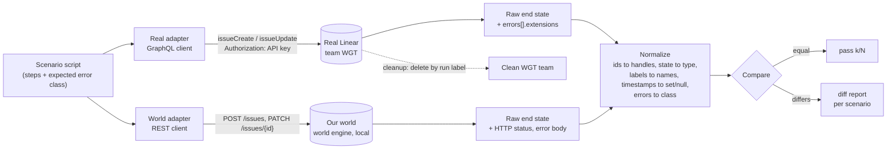

# Linear for WorldGen: decision note

Status: historical. This is the D1 decision note of 2026-10-06, kept for its reasoning. The current workflow is the "How work lands" section of [AGENTS.md](../AGENTS.md). The team ended up as YOS, project WorldGen, not WG. Workspace: https://linear.app/yossi-zozo123

## 1. Verdict

- **Tracker: yes, minimal.** Linear holds tasks and status only. GitHub holds code and PRs only. The repo holds the vision and decisions (DESIGN.md, decisions.md, plan.md), because only the repo reaches the hiring team. Time box the setup to 1 hour. If it is not working by then, fall back to GitHub Issues.
- **The split with GitHub.** Turn on the Linear GitHub integration for PR and commit linking only. Leave GitHub Issues Sync off. Close GitHub issue #1 with a link to its Linear copy. Retire `research/tools/file_issues.py`.
- **Testbed T1 (CSV of our own backlog): must, D5.** It rides on CSV ingest, which the spec already requires. About 1 to 3 hours.
- **Testbed T2 (static schema fidelity, offline): should, D6 or D7.** The prototype already runs. It needs a frozen core type list and a grader hook in `eval/`. About 2 hours.
- **Testbed T3 (live differential test): could, after the D7 freeze only.** Time box 4 hours, 5 scenarios, separate test team, API key never visible to WorldGen. Nothing in the engine or WorldGen calls Linear at runtime.

## 2. Setup steps

### What the user runs (about 15 minutes)

1. Connect Claude Code to Linear with the official remote MCP server. Source: https://linear.app/docs/mcp (verified 2026-10-06).
   ```
   claude mcp add --transport http linear-server https://mcp.linear.app/mcp
   ```
   Then run `/mcp` inside Claude Code and finish the OAuth login in the browser. `claude mcp list` shows it is connected. Source for `/mcp` and `claude mcp list`: https://code.claude.com/docs/en/mcp (verified). Add `--scope user` if you want it in every project (same source).
2. In Linear, create the team `WorldGen` with key `WG` (Settings > Teams). Create a second team `WorldGen Test` with key `WGT` only if T3 is approved.
3. Connect GitHub: Settings > Integrations > GitHub, pick the repo `jop8281/worldgen`. Turn on PR linking. Leave "GitHub Issues Sync" off. Source: https://linear.app/docs/github. Unverified: whether the basic GitHub integration is on the Free plan. Check it in the integrations page.
4. Only if T3 is approved, and not before D7: create a personal API key at Settings > Security & access (https://linear.app/settings/account/security). Store it as `LINEAR_API_KEY` in your shell only. Never in the repo, `worldgen.config.json`, or the WorldGen env. Header is `Authorization: <API_KEY>` with no "Bearer". Source: https://linear.app/developers/graphql.

### What Claude does after

1. Runs `/mcp` to list the real tool names. The Linear docs do not list them, so the third-party list is unverified.
2. Creates the project, milestones, labels and issues through MCP (layout in section 3).
3. If MCP has no tool for issue relations, writes each dependency as a `Blocked by: WG-n` line in the issue description and tells you. You add the real relations by hand in the UI (about 15 minutes), or we accept the text lines.
4. Recreates GitHub issue #1 in Linear, then closes #1 with `gh issue close 1 --comment "Moved to Linear: <url>"`.
5. From then on: picks the next issue through MCP, uses the Linear branch name, puts `Fixes WG-n` in each PR title or description, and comments on the issue when a decision changes.

## 3. Workspace layout and backlog import

| Item | Value | Notes |
|---|---|---|
| Team | `WorldGen` (`WG`) | Only team for real work |
| Test team | `WorldGen Test` (`WGT`) | Only for T3. Free plan allows 2 teams, so this uses the last slot |
| Project | `WorldGen trial` | Target date D8. Description is one paragraph plus links to DESIGN.md, decisions.md and spec.md in the repo. No Linear Docs copy of the vision |
| Milestones | D1 to D8 | Project milestones, one per day, with target dates. Names copied from `MILESTONES` in `file_issues.py`. No cycles |
| Label group `area` | engine, worldgen, eval, docs, infra | One per issue |
| Label group `kind` | feature, decision, chore, test | One per issue |
| Priority | Built-in field | must = High (2), should = Medium (3), could = Low (4). Urgent (1) only for today's critical-path blocker. Cutting scope is a filter on priority |
| States | Backlog, Todo, In Progress, In Review, Done, Canceled | Add In Review in the Started category. Triage off |
| PR automation | Open or draft: In Progress. Review requested: In Review. Merged to `main`: Done | Settings > Team > Workflows & automations |

**Import plan**

- Source: the 50-issue draft (milestone, area, kind, priority, acceptance, depends_on).
- Path: Claude creates issues one by one through MCP. 50 calls is fine and needs no API key.
- Each description holds: summary, a `## Acceptance` checklist (`- [ ] ...`), and a hidden backlog key marker so a rerun can skip existing issues.
- Order: milestones and labels first, then issues in milestone order, then dependencies.
- Dependencies: `issueRelationCreate` with type `blocks` exists in the GraphQL schema. The MCP tool for it is unverified. The fallback is the text line from step 3 above.
- Budget: 50 of 250 issues on Free. That leaves room for T3.
- Check: the Linear count per milestone matches the draft count per milestone.

## 4. Testbed design

| Tier | What | Metric | Effort | Milestone | Priority | Risks |
|---|---|---|---|---|---|---|
| T1 | Export WG issues as CSV, redact names, add as a `csv` case in `eval/suite.yaml`, run WorldGen on it | Issue row count equal. 100% of non-empty Team, Project, Assignee, Labels, Parent cells resolve to refs. State category inference at least 90% right against a hand label | 1 to 3 h | D5 | must | Labels cell separator unverified. Personal data in export. 50 rows give a thin state mix |
| T2 | Compare the real Linear SDL (core 8 types plus vocabularies) against the world WorldGen builds from "issue tracker like Linear" | Weighted coverage at least 0.80. Zero `field.type_mismatch`. No `transitions.stricter_than_real`. Prototype scores 0.649 on a sample world | 2 h (prototype done) | D6 or D7 | should | Core list must be frozen in the repo. Name matching is heuristic |
| T3 | Same scenario against real Linear (GraphQL, team WGT) and our world (REST), normalize, compare | k of N scenarios with equal normalized end state and equal error class. Target 5 of 5 | 4 h time box | after D7 freeze | could | 250-issue cap. Trashed issues may count (unverified). Leaked key. Team automations. Linear behavior can change |

**T3 scenarios (cut to 5):** create lands in default Backlog state. Move backlog to completed. Jump completed back to backlog, which real Linear allows. Add 2 labels and remove 1. Create without teamId gives a validation error.

**Key fidelity finding.** Real Linear documents no transition rules. Our engine refuses illegal transitions (A-10). So a faithful Linear world needs an any-to-any transition graph, and a world that invents stricter rules is flagged.

**Normalization.** Ids become symbolic handles in creation order. State ids become state types. Labels become names. Timestamps become null or set, plus order. Drop url, sortOrder, branchName. Errors map to `validation`, `not_found`, `auth`, `rate_limited`, `conflict`.

**Cleanup.** Every T3 issue gets label `wgt-run-<id>`, then `issueDelete(id, permanentlyDelete: true)`, then a check that nothing with that label remains.



## 5. Where the critic disagreed and how it was resolved

- **Vision in Linear docs vs in the repo.** The tracker research put the vision in project documents. The critic said the repo only. Resolved for the critic: the repo is the single home, and the project description only links to it. Only the repo reaches the hiring team.
- **GraphQL import script vs MCP.** The research proposed a one-time GraphQL script with an API key. The critic called that scope creep. Resolved for the critic: import through MCP with OAuth, no key. Relations fall back to description lines if MCP lacks them.
- **Live testbed: build vs do not build.** The critic said no live test, since it costs 1.5 to 3 days and is not a spec requirement. The user explicitly asked to test against the real product. Resolved in the middle: T1 is a must because it reuses required CSV ingest. T2 is a should because it is already built. T3 is a could, time boxed to 4 hours and 5 scenarios, after the D7 freeze.
- **Security.** Agreed with the critic: the API key lives only in the user's shell for T3. WorldGen and the engine never have a path to Linear. T3 never touches team WG.
- **GraphQL vs OpenAPI ingest.** Agreed: Linear is not an OpenAPI input. We do not build GraphQL ingest. Linear enters WorldGen only as a CSV case (T1) and a description prompt (T2). The T3 adapter is hand written per scenario.
- **Priority as label vs field.** The critic wanted cut-line labels. Resolved for the built-in priority field, which filters the same way and avoids a duplicate.

## 6. Questions for the user

1. **Tracker scope.** (a) Tasks only, vision in repo. (b) Tasks plus vision docs in Linear. (c) Stay on GitHub Issues. **Recommend (a).**
2. **Testbed depth.** (a) T1 only. (b) T1 plus T2. (c) T1, T2 and T3 after D7. (d) Full T3 now. **Recommend (c)**, with T3 dropped first if D7 slips.
3. **Second team for T3.** (a) Use the second Free team slot `WGT`. (b) A separate free workspace. (c) No live writes, read-only only. **Recommend (a).** Option (b) gives better isolation if you do not mind a second login.
4. **Dependencies if MCP has no relation tool.** (a) Text lines in descriptions. (b) You add relations by hand in the UI. (c) Allow a small GraphQL script with an API key. **Recommend (a)**, then (b) for the D1 to D3 critical path only.
5. **Can the redacted backlog CSV be committed to the repo as an eval fixture?** (a) Yes, names replaced. (b) No, keep it local. **Recommend (a).** It is real product data the reviewers will recognize.

## Sources

- https://linear.app/docs/mcp (MCP command, endpoints, auth: verified 2026-10-06)
- https://code.claude.com/docs/en/mcp (`claude mcp add`, `--scope`, `/mcp`, `claude mcp list`: verified 2026-10-06)
- https://linear.app/docs/github, https://linear.app/developers/graphql, https://linear.app/developers/rate-limiting, https://linear.app/docs/exporting-data, https://linear.app/docs/configuring-workflows, https://linear.app/docs/issue-relations, https://linear.app/docs/project-milestones, https://linear.app/pricing (from the research notes)
- Unverified: MCP tool names, MCP relation support, GitHub integration on Free, whether trashed issues count toward 250, CSV labels separator, error code for a missing issue id.
