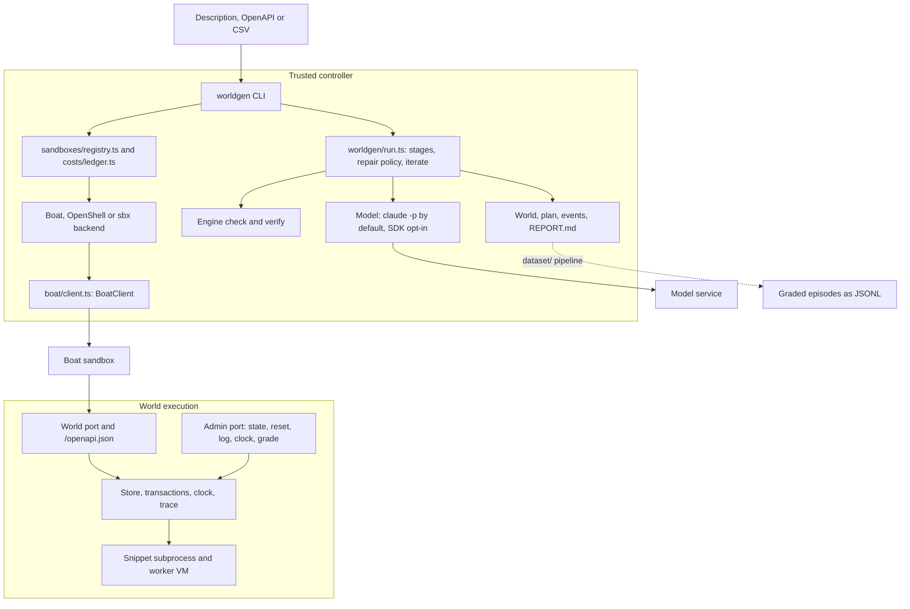

# Runtime architecture

This file records who owns what at run time. [architecture.md](architecture.md) holds the module layout and the reasons. The module map in `AGENTS.md` and the directory tree in `architecture.md` each name every source file, and `test/architecture.test.ts` fails when either misses one; it does not check the ownership table below, which is prose. A diagram records boundaries. It does not prove behavior, so check the code and tests before relying on it.

## Ownership

| Concern | Owner |
|---|---|
| Whether a world is acceptable, and every grade | The engine (`engine/check.ts`, `engine/tasks.ts`). No model grades. |
| Stage order, retries, backtracks and stops | `worldgen/run.ts` with `worldgen/policy.ts`. Acceptance is `worldgen/judge.ts`. |
| Iteration on an existing world | `worldgen/iterate.ts` with the preservation gate in `judge.ts`. |
| Model calls and their cost | `worldgen/llm.ts`, metered by `costs/meter.ts` into `costs/ledger.ts`. |
| Sandbox provisioning, upload, run and stop | A `SandboxBackend` from `sandboxes/registry.ts`. Boat goes through `BoatClient` only. |
| Public OpenAPI and its fidelity to a source spec | `engine/openapi.ts` and `engine/openapi-fidelity.ts`. |
| Solver episodes and JSONL export | `dataset/`, with the solver's `Model` injected. |
| Snippet isolation | `engine/sandbox.ts`: a subprocess of the running runtime, a worker VM and a heap limit. |

## Executables

Package scripts and tests run on Bun, the only runtime (A-379, A-381). A snippet subprocess starts `process.execPath`, so it uses Bun too. Bun ignores Worker `resourceLimits`, so CI no longer enforces the snippet heap bound that the retired Node job gated (A-87, replaced by A-379).

## Limits

Worker heap and execution limits contain snippet failures. They do not bound allocations by host-side schema, reference or seed validation. The engine verifies reference solutions, no-ops, decoys and prefixes against its own grading rules. That does not establish that a solver's final reply is factually right.

Update this file when ownership, credentials, process isolation or deployment topology change. Module edges cannot show those.
